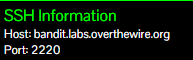
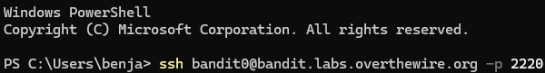
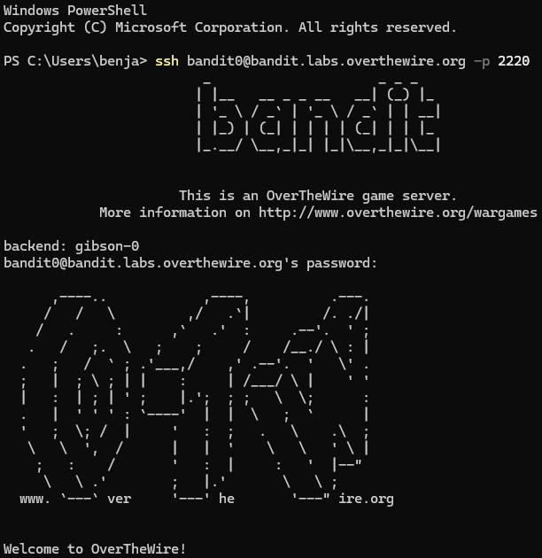

Pour se connecter en SSH, nous devons renseigner :
- le nom d'utilisateur
- l'adresse / le domaine auquel nous souhaitons nous connecter
- le port

SSH pour Secure Shell est un protocole de communication, transfert de fichier sécurisé et chiffré. Concrètement cela va permettre d'interagir avec un domaine à distance, par exemple un serveur. C'est l'une des manières les plus sécurisées pour interagir, communiquer ou partager des fichiers.

Plusieurs outils existent pour se connecter en SSH à un domaine distant comme : Powershell, CMD, Putty, Visual Studio Code, Terminal Linux etc etc...

Heureusement, ces informations sont données directement sur le site de overthewire

le nom d'utilisateur sera le nom du niveau donc bandit0
l'adresse / le domaine est bandit.labs.overthewire.org
le port est 2220

on doit donc renseigner la commande suivante : 
- ssh bandit0@bandit.labs.overthewire.org -p 2220

puis une fois connecté, il faut renseigner le mot de passe : bandit0

Une fois connecté, on arrive sur cet écran, bravo, on a réussi à accéder au premier niveau

C'est une structure qu'il faut garder en tête puisque ce sera notre manière de nous connecter au prochain niveau
avec le nom d'utilisateur qui sera différent et des changements sur la manière de se connecter par la suite

à noter qu'ici le pass nous est donné, mais qu'à l'avenir il faudra le trouver nous-mêmes, il faudra aussi les noter pour ne pas les oublier