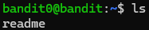
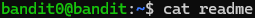

Nous sommes désormais connectés sur notre domaine distant, le problème étant, comment interagir avec ce domaine ? Quelle commande utiliser, que faire tout simplement ?
La description du niveau nous explique que dans notre dossier perso du niveau, il existe un fichier qui s'appelle readme. Ce fichier contient le mot de passe qui nous permettra d'accéder au niveau suivant

Comme je l'ai expliqué pour le niveau bandit0, il faut absolument créer un fichier pour prendre des notes sur la résolution des niveaux et noter les mots de passe puisqu'ils ne sont pas sauvegardés automatiquement, sinon on encourt la perte de notre progression

La logique pour les prochains niveaux va être toujours quasiment la même, on doit trouver le pass du niveau à l'aide de la description, ce pass nous permettra d'accéder au niveau suivant et ainsi de suite, il est tout de même à noter que par la suite cette logique va être bafouée.

Tout d'abord, pour vérifier où se trouve le fichier readme on peut utiliser la commande ls
ls qui est un diminutif pour list est une commande qui permet de voir le contenu de notre répertoire courant si on ne lui donne pas d'option. 
On verra par la suite qu'on peut voir le contenu d'un dossier précis, voir les permissions et les propriétaires des fichiers ou même voir des fichiers invisibles

En faisant un simple ls, on constate qu'un seul fichier est présent dans notre répertoire courant : readme

Pour lire le contenu de ls il y a plusieurs manière de faire comme nano, vim mais pour rester dans la simplicité il faut simplement utiliser la commande cat comme ceci : 

Cat qui est un diminutif de concatenate est une commande qui affiche le contenu d'un fichier dans le terminal, c'est parfait pour notre cas d'utilisation actuel mais on verra qu'il atteindra vite ses limites pour des fichiers conséquents.

Le pass est ainsi obtenu, lors de la connexion au prochain niveau il n'y aura plus qu'à le renseigner.