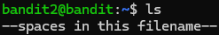
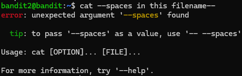

Celui-ci est plutôt tricky car le nom du fichier que nous devons ouvrir s'appelle "--spaces in this filename--".
Le problème c'est que le tiret est considéré comme un flag, une option qui vient à la suite d'une commande.
Il m'a ainsi fallu un certains temps pour comprendre comment palier à ce problème.

Comme pour le niveau précédent on suit la même logique
En premier lieu on utilise la commande ls pour voir le nom de notre fichier

Le problème se pose à partir de maintenant, pour chaque commande qu'on pourrait utiliser pour ouvrir ce satané fichier, les tirets au début nous bloquent totalement car Linux pense qu'on souhaite ajouter une option à notre commande.
Ainsi, il est impossible d'utiliser tabulation pour remplir le nom du fichier. Il est également impossible d'indiquer le nom du fichier de cette manière, on obtient une erreur.

La solution consiste à mettre un './' devant le nom du fichier, ainsi le système comprend qu'on souhaite appliquer cat sur le fichier et non rajouter une option à la commande cat

ainsi en rajoutant simplement un tiret après le './' et en pressant la commande tab, Linux remplit automatiquement le nom du fichier. À noter qu'il rajoute lui-même des '/' et '\' entre les mots pour bien montrer qu'il s'agit d'un seul et même fichier, ce n'est pas plusieurs mots séparés par des espaces.

En bref un exercice pas si difficile mais je dois avouer que ça m'a bien pris un certains temps rien que pour trouver qu'il fallait mettre le `./` devant le tiret pour expliquer qu'il s'agit du nom du fichier et non un flag de commande 

