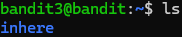
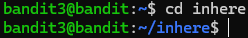
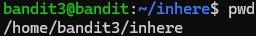
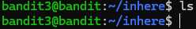
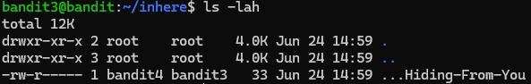
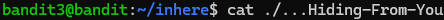

contexte : Cette fois-ci le code se trouve dans un fichier caché, nous devons donc trouver un moyen de le trouver dans notre arborescence, puis de l'ouvrir pour obtenir le code pour la suite du challenge.

étape 1 : Utilisation de ls pour voir s'il y a du contenu visible sur notre dossier courant

Petite aparté mais on peut voir qu'ici le "fichier" visible via la commande ls est coloré en bleu, cela signifie qu'il s'agit en réalité d'un dossier, les fichiers simples sont colorés en blanc.

étape 2 : Utilisation de la commande cd pour se déplacer dans le dossier

cd pour Change Directory permet de se déplacer dans l'arborescence de Linux.

À  noter qu'à côté de notre nom d'utilisateur, le répertoire où nous nous situons est indiqué, ce répertoire est noté en chemin relatif, on voit seulement son nom en partant du tilde (~).
si on souhaite voir le chemin absolu de notre dossier, à partir de la racine (tout en haut de l'arborescence) '/' on peut utiliser la commande pwd pour print working directory.

étape 3 : Utilisation de ls
une fois présent dans le dossier inhere on peut de nouveau utiliser ls, Cette commande va forcément rater puisque ce que nous recherchons est un dossier caché :

il faut ainsi que je vous explique les options importantes de ls : 

Description de la commande ls -lah : 
Le flag -l (pour long) permet d'afficher les fichiers en format long avec les permissions, le propriétaire et des données relatives au temps.
Le flag -a (pour all) permet d'afficher tous les fichiers présents dans le répertoire même ceux cachés, utile pour trouver les hidden files
Le flag -h permet de transformer les infos lisibles pour les humains 
en gros, on lui demande de nous donner le plus de détails sur les fichiers ou dossiers présents dans le répertoire et de nous le rendre le plus lisible possible

étape 4 : Utilisation de la commande ls -lah : 

Bingo ! un fichier est bien présent dans le dossier inhere, comme pour le niveau précédent, il commence par des caractères spéciaux, il faut donc réutiliser l'astuce du './'

étape 5 : ouverture du fichier et découverte du flag

Ainsi il est désormais possible de passer à la suite du niveau