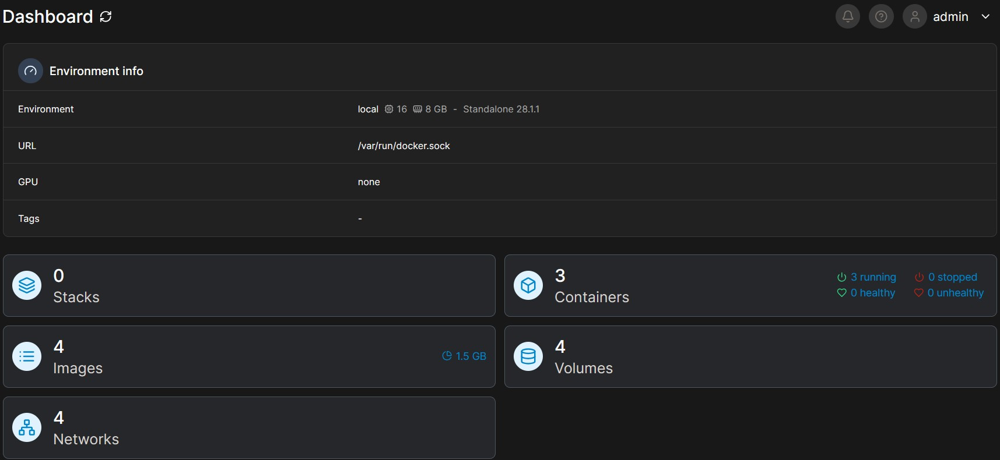
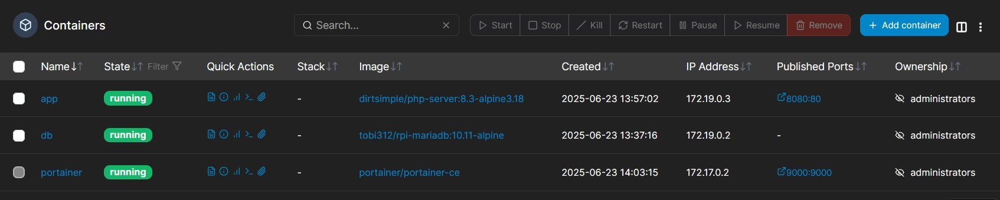
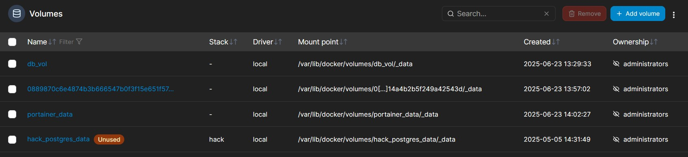
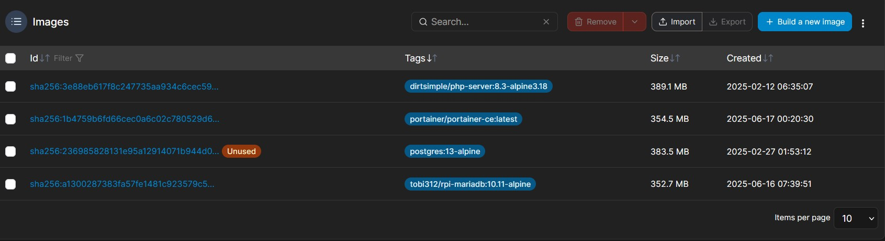
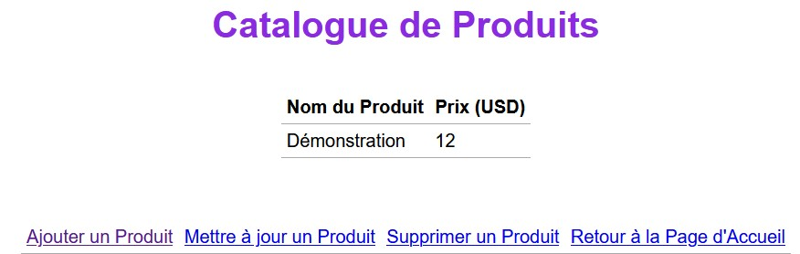

# Docker Tech Stack

!!! info "Contexte du projet (Méthode STAR)"
    * **Situation** : Nécessité de déployer une stack applicative multi-conteneurs (Web PHP + Base de données MariaDB) de manière reproductible et automatisée.
    * **Tâche** : Utiliser **Terraform** (Infrastructure as Code) pour provisionner l'infrastructure sur un hôte Docker distant, en garantissant la persistance des données et l'isolation réseau.
    * **Action** : Rédaction des configurations Terraform pour la gestion des images, des conteneurs, du mappage des ports (8080:80) et des volumes persistants (`db_vol`), puis supervision via Portainer.
    * **Résultat** : Un déploiement entièrement automatisé et fonctionnel, validé par l'interaction dynamique entre l'application web et la base de données.

Voici le résumé de mon travail pour le TP sur le déploiement d'une stack applicative. L'objectif était de monter une application web (catalogue de produits) avec sa base de données MariaDB, en utilisant Terraform pour créer l'infrastructure sur Docker.

J'ai joint plusieurs captures d'écran de mon interface Portainer pour montrer que tout est bien en place et fonctionnel.

## 1. Vue générale de l'environnement

Pour commencer, la capture du tableau de bord Portainer donne une bonne vue d'ensemble :



On y voit directement les 3 conteneurs qui tournent, ce qui correspond bien à ce qui était attendu : le service web (app), la base de données (db) et Portainer lui-même. On remarque aussi les 4 volumes créés, ce qui indique que la persistance des données a bien été prise en compte.

## 1.1 Code Terraform d'infrastructure

Voici un extrait de la configuration Terraform utilisée pour provisionner l'application web :

```hcl
resource "docker_image" "php_app" {
  name         = "dirtsimple/php-server:8.3-alpine3.18"
  keep_locally = true
}

resource "docker_container" "app" {
  image = docker_image.php_app.image_id
  name  = "app"
  ports {
    internal = 80
    external = 8080
  }
}

## 2. Les conteneurs en détail

Si on zoome sur la partie conteneurs, on retrouve bien nos trois
services.

- Le conteneur app est bien en statut running et utilise l'image
  dirtsimple/php-server. On voit bien le mapping de port 8080:80, qui
  permet d'accéder à l'interface web.

- Le conteneur db pour la base de données tourne aussi. Point important,
  il n'expose aucun port sur l'extérieur, ce qui est normal. La
  communication se fait via le réseau interne Docker.

- Le conteneur portainer est celui de l'interface de gestion.

Tout ce qui a été déployé avec Terraform est donc bien en cours
d'exécution.

## 3. La persistance des données avec les volumes

Un point clé du TP était de s'assurer que les données de la base ne
soient pas perdues. Ce qui est montré dans le screen
ci-dessous.



On voit très clairement le volume nommé db_vol. C'est lui qui est lié
au conteneur db et qui stocke les données de MariaDB de manière
persistante.

## 4. Images Docker utilisées

Cette capture liste simplement les images qui ont servi de base pour
lancer les conteneurs.



On retrouve logiquement les images de mariadb, php-server et portainer
qui correspondent aux services qui tournent.

## 5. Preuve finale : l'application fonctionne !

Pour finir, la capture la plus importante : celle de l'application web
elle-même.



Le fait que la page "Catalogue de Produits" s'affiche prouve que le
serveur web répond bien sur le port 8080. Mais surtout, l'affichage du
produit "Démonstration" avec son prix montre que la connexion entre le
conteneur app et le conteneur db fonctionne parfaitement. L'application
a bien pu lire les informations dans la base de données et les afficher.

En conclusion, l'ensemble de ces images montre que l'infrastructure a
été déployée correctement, que chaque composant est fonctionnel et que
l'application finale marche comme prévu.