# TP : Haute Disponibilité sur Proxmox

!!! info "Contexte du projet (Méthode STAR)"
    * **Situation** : Nécessité de garantir la continuité de service et la résilience d'une infrastructure virtualisée face à la panne d'un hyperviseur.
    * **Tâche** : Mettre en place un cluster Proxmox à 3 nœuds, configurer un stockage partagé distribué avec **Ceph**, et activer la Haute Disponibilité (HA) sur une machine virtuelle.
    * **Action** : Création de la grappe de serveurs, ajout et jonction des nœuds secondaires, installation de Ceph et configuration des OSD avec ajout de disques virtuels dédiés, paramétrage des moniteurs, création d'un pool RBD résilient, et test de bascule (faille) par extinction forcée d'un nœud.
    * **Résultat** : Un cluster hautement disponible où la VM critique est automatiquement redémarrée et prise en charge par un autre nœud en cas de panne matérielle.

## 1. Mise en place du cluster Proxmox

### 1.1 Création de la grappe de serveurs
Après avoir installé notre machine Proxmox principale (`pve`) sur l'hyperviseur VMware Workstation, nous accédons à l'interface web d'administration. Pour créer le cluster, il faut se rendre dans le **Centre de données** > **Grappe de serveurs** > **Créer une grappe de serveurs**.

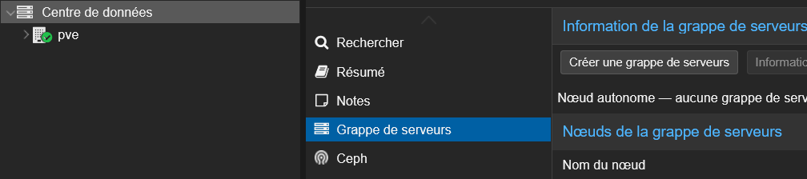

On nomme le cluster "Cluster" en conservant l'adresse IP par défaut.

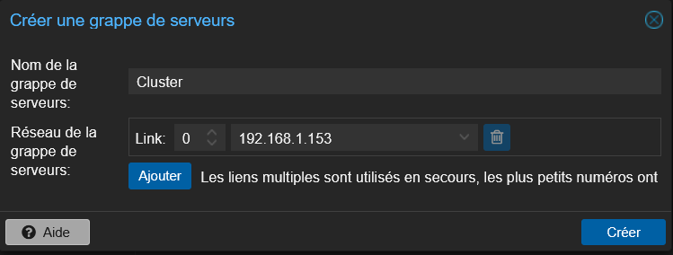

La grappe de serveurs est désormais opérationnelle.

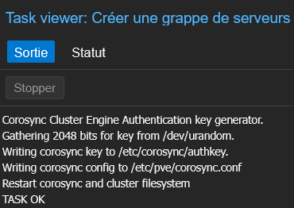

### 1.2 Intégration des nœuds secondaires
Pour obtenir un quorum bien équilibré et fonctionnel, un cluster de Haute Disponibilité requiert au moins 3 nœuds. Deux autres instances de Proxmox ont donc été déployées sur l'hyperviseur.

Depuis le premier nœud, on récupère les informations de jonction du cluster.

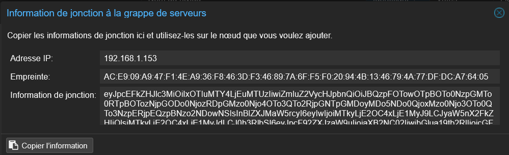

En se connectant au second nœud, on renseigne les informations du cluster ainsi que le mot de passe du nœud primaire pour l'y intégrer.

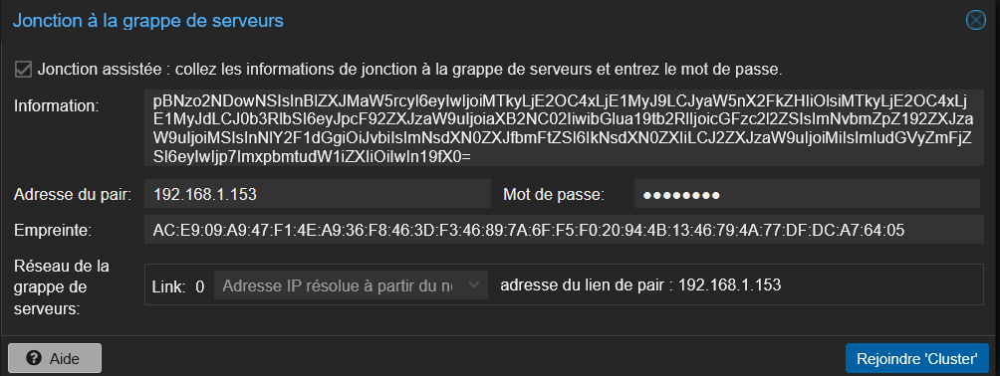

La même opération est réalisée pour le troisième nœud. Les trois machines font désormais partie du même cluster.

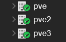

---

## 1.4 Installation et configuration de Ceph

Pour configurer le stockage distribué, nous passons par l'onglet **Ceph** pour lancer l'installation.

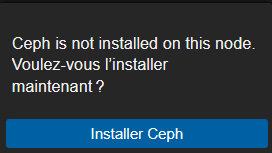

On sélectionne la dernière version de Ceph sans abonnement.

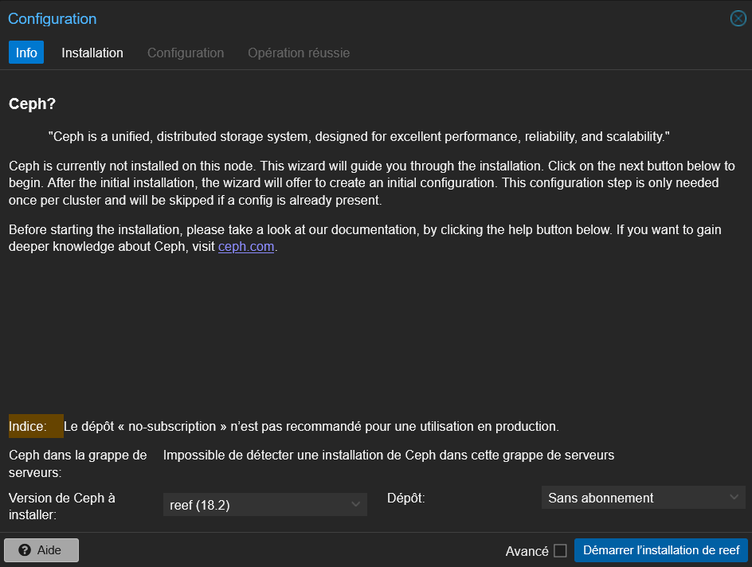

Une fois l'installation des composants terminée sur les trois nœuds :

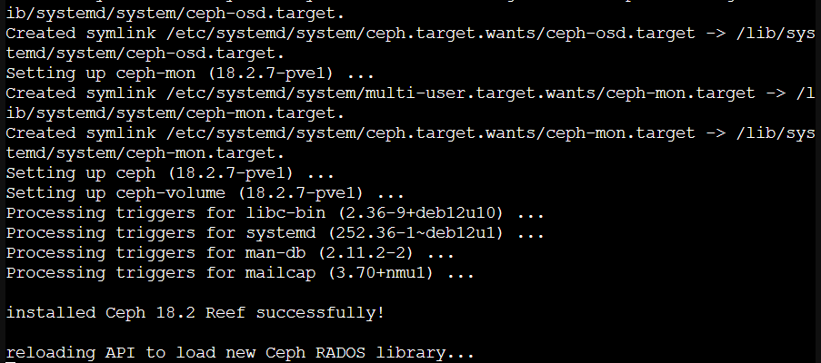
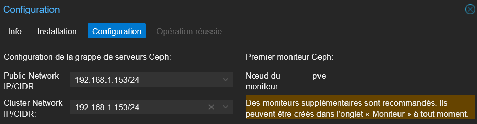

### 1.5 Ajout d'un disque virtuel et création des OSD
Avant de configurer les OSD (Object Storage Daemon), chaque nœud doit disposer d'un disque virtuel supplémentaire non utilisé, configuré depuis VMware Workstation.

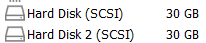

On procède ensuite à la création des OSD en sélectionnant le disque non utilisé pour chaque nœud.

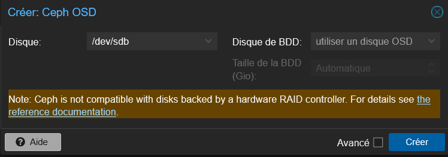

Une fois configurés sur les trois nœuds, le stockage distribué est en place.

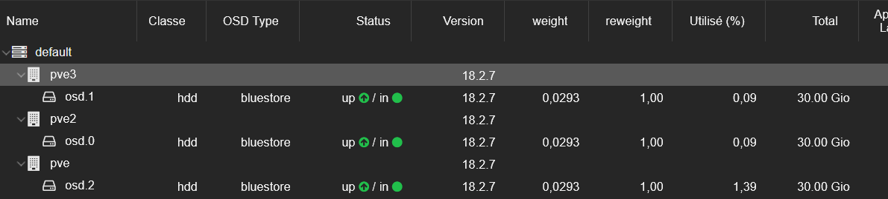
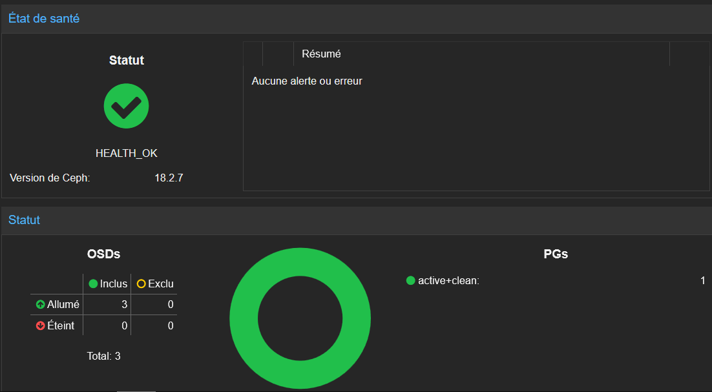

### 1.7 Ajout de moniteurs (MON) sur les nœuds 2 et 3
* **Le problème** : Le Moniteur (MON) est le cerveau du cluster Ceph. Si le nœud principal `pve` tombe en panne, le cluster deviendrait aveugle et se bloquerait sans redondance des moniteurs. La bonne pratique sur 3 nœuds est d'avoir 3 moniteurs (un par nœud).

On crée ensuite un nouveau pool pour nos trois nœuds avec les options avancées recommandées :
* **Min. Size** : Réglé sur 2 (garantit l'écriture sur au moins 2 nœuds avant validation).
* **Application** : Sélection de `rbd` (optimisé pour les disques de machines virtuelles).

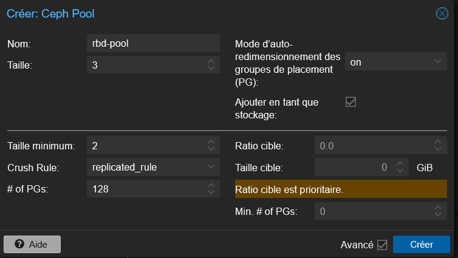

### 1.8 Intégration du Pool dans Proxmox (Stockage RBD)
Le stockage RBD est ensuite intégré à Proxmox.

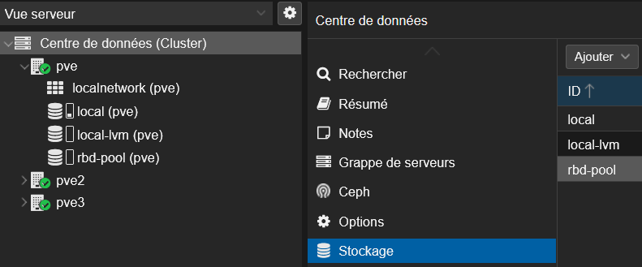
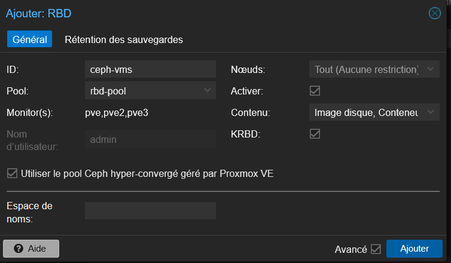

---

## 1.9 Création et configuration d'une VM pour la Haute Disponibilité

Après avoir téléversé l'image ISO, nous procédons à la création de la machine virtuelle dédiée aux tests de résilience.

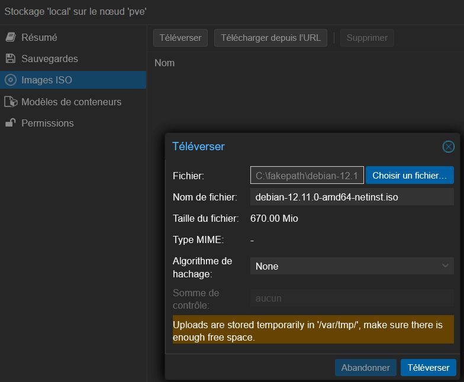
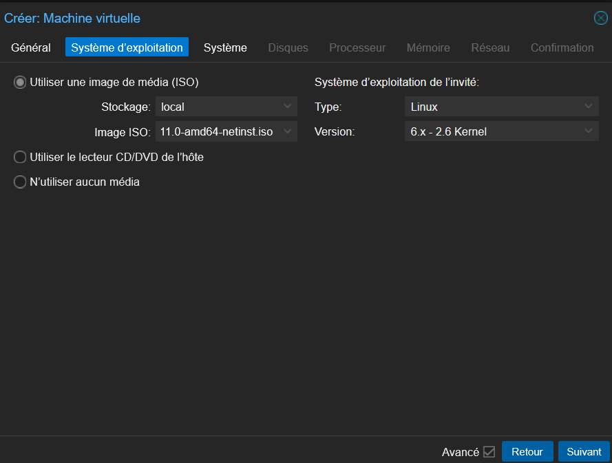
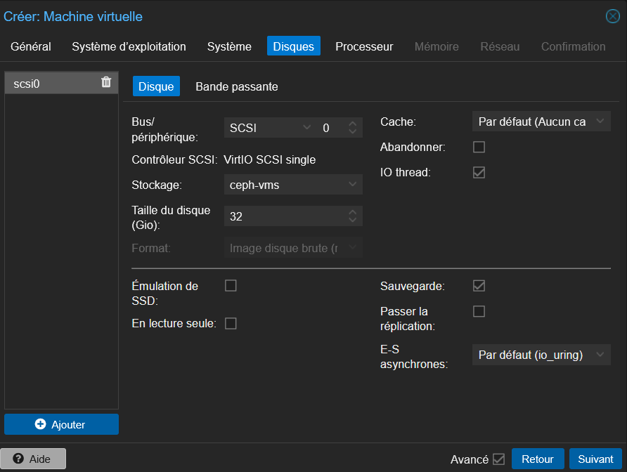
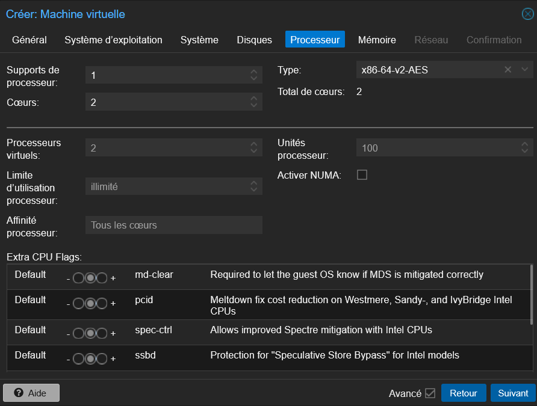
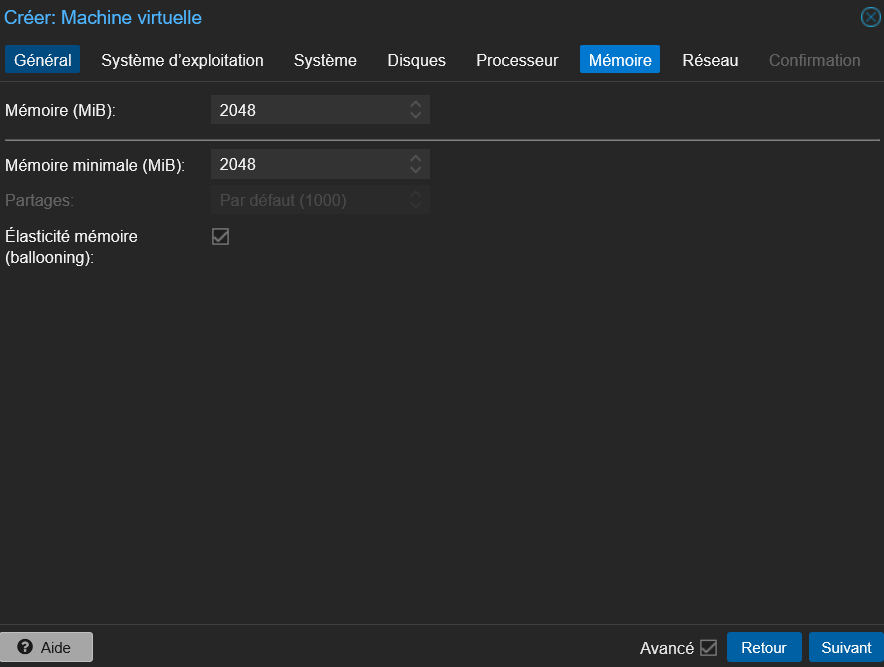
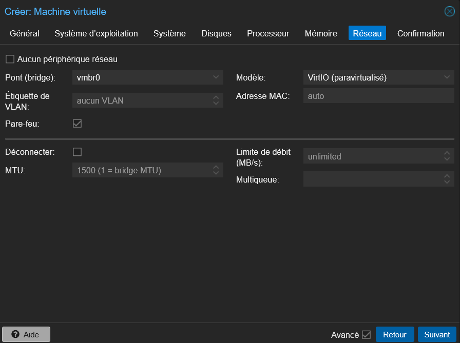

---

## 2. Mise en place de la Haute Disponibilité (HA) et test de panne

Une fois la VM installée et fonctionnelle sur le premier nœud, nous activons la règle de Haute Disponibilité.

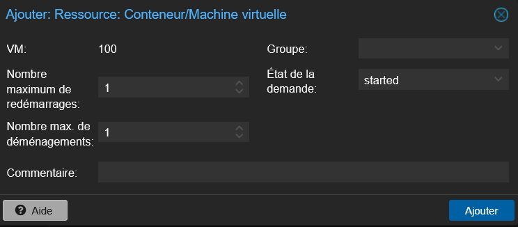
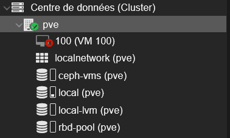

### 2.1 Simulation de panne (Failover)
Pour valider le comportement du cluster, nous simulons la panne matérielle en éteignant de force le nœud 1 (`pve`) qui héberge la machine virtuelle.

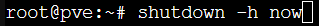

**Résultat** : Face à l'interruption du nœud primaire, le cluster détecte la défaillance et transfère / redémarre automatiquement la machine virtuelle sur un autre nœud disponible (`pve2` ou `pve3`), garantissant ainsi le maintien du service et le principe de la Haute Disponibilité.
