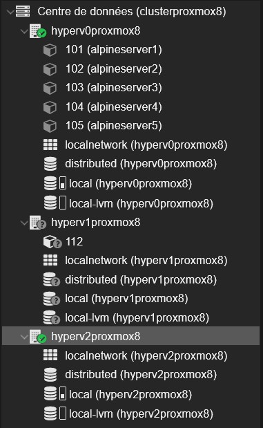

# Terraformer sur Proxmox

!!! info "Contexte du projet (Méthode STAR)"
    * **Situation** : Nécessité de centraliser et d'automatiser le déploiement de conteneurs sur une infrastructure virtualisée Proxmox.
    * **Tâche** : Mettre en place un cluster multi-nœuds et utiliser Terraform pour automatiser le provisionnement de conteneurs LXC.
    * **Action** : Configuration d'un cluster à 3 serveurs (`hyperv0`, `hyperv1`, `hyperv2`) et déploiement scripté de 5 conteneurs LXC (`alpineserver1` à `alpineserver5`) sur le premier nœud.
    * **Résultat** : Un déploiement automatisé et réussi, centralisé sur l'infrastructure Proxmox.

## 1. Vue d'ensemble du cluster Proxmox

Ici, on voit l'interface de gestion où j'ai mis en place un cluster avec trois serveurs : `hyperv0`, `hyperv1` et `hyperv2`. Le but était de tout centraliser.

## 2. Déploiement automatisé des conteneurs LXC

L'objectif principal était de déployer des conteneurs LXC. Comme on le voit sur l'interface, j'ai bien réussi à déployer les 5 conteneurs demandés, de `alpineserver1` à `alpineserver5`. Ils tournent tous sur le premier nœud, `hyperv0`.
