# Audit, Durcissement IaC & Détection de Menaces sur Azure

!!! info "Contexte du projet (Méthode STAR)"
    * **Situation** : Audit et sécurisation d'une infrastructure Azure déployée via Bicep et compromise suite à des vulnérabilités de configuration et d'identités.
    * **Tâche** : Identifier les failles d'IaC, appliquer le hardening Bicep, analyser la posture avec Defender for Cloud et créer des règles de détection KQL sous Sentinel.
    * **Action** : Correction des secrets en clair, restriction des accès réseau/TLS, investigation KQL sur un cas de force brute et d'impossible travel, et écriture d'une règle analytique YAML.
    * **Résultat** : Un modèle Bicep conforme aux meilleures pratiques et une traçabilité complète de l'incident avec cartographie MITRE ATT&CK.

## Installation des prérequis

Après avoir ajouté l'extension bicep via le gestionnaire d'extension, on
peut l'installer avec la commande suivante :

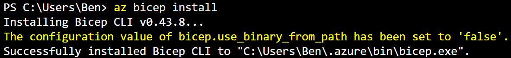

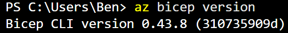
Cette commande prouve bien que notre extension est bien installée et
reconnue par le système.

Après avoir installé python 3 sur notre système, la commande pip est
bien reconnu et permet d'installer pandas :

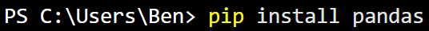

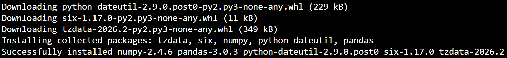

## 1. Gouvernance IaC (Bicep, Policies & RBAC)
### 1.1 - Audit du template Bicep

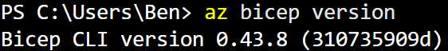

Test de l'importation de la bibliothèque panda

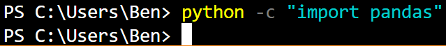

C'est normal si le CLI ne nous retourne rien, cela signifie que la
bibliothèque a déjà bien été importé et donc qu'il n'y a pas d'erreur.

Le nom et les colonnes de chaque table :

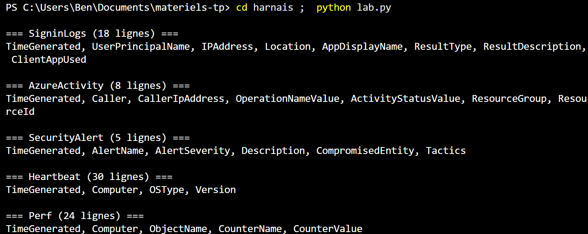

Module 1 -- Gouvernance : Bicep, Policy, RBAC

1.1 -- Audit du template Bicep

Dans un premier temps on ouvre le fichier à l'aide de la commande
suivante :

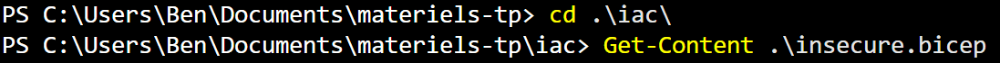

Lorsqu'on ouvre le fichier insecure.bicep plusieurs failles béantes sont
visible dès un premier coup d'œil

Tout d'abord le mot de passe est en clair, ce qui signifie que n'importe
qui, qui aurait accès au code pourrait ainsi voir ce mot de passe et
pourrait ainsi prendre le contrôle du système

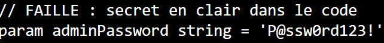

On peut d'ailleurs faire le lien avec le manque de key vault, ce qui
serait un bon moyen de remédiations pour éviter d'avoir le mot de passe
en clair et ainsi renforcer la sécurité. Notre mot de passe serait ainsi
stocké en tant que secret dans le key Vault

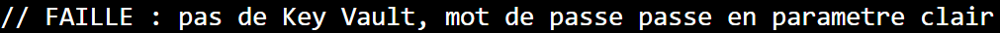

Q1.1 : C'est une faille qui se rattache au pilier secrets

Ensuite l'accès public est autorisé ce qui signifie que n'importe qui
peut se connecter, il n'y a pas de contrôle d'accès mis en place, donc
on ne sait pas qui se connecte, on ne sait pas les actions réalisées où
l'heure à laquelle ça a été réalisé, également on ne sait pas les
permissions qui seraient accorder à la personne

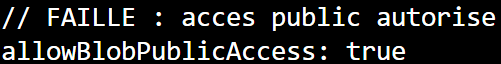

On peut également faire le lien avec le fait qu'il n'y ai pas de
diagnostic-setting aujourd'hui mis en place, on peut voir cela comme un
mécanisme qui va collecter les logs et qui va envoyer les métriques vers
diverses ressources.

S'il n'est pas mis en place Azure monitor par exemple ne pourra pas
collecter les logs et donc on n'a aucune information d'horodatage, on se
pas qui réalise quelle action, qui se connecte, c'est l'anarchie et on
est également forcément en tort en cas d'attaque informatique et qu'on
nous demande une justification d'actions.

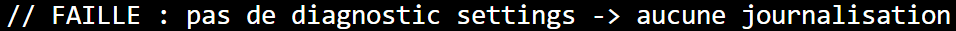

Q1.1 C'est une faille qui se rattache au pilier journalisation

Une autre faille béante est la tolérance de la connexion en http non
chiffré, concrètement cela signifie que toutes les informations passent
en clair dans le trafic. Si un attaquant se place en posture de
man-in-the-middle il pourra alors intercepter le trafic et ainsi voir
tous les flux en clair.

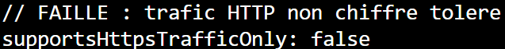

C'est une faille qui se rattache au pilier chiffrement

On peut souligner également la non-restriction réseau, chaque composant
du réseau est présent dans un réseau central, il n'y a pas d'ACL mis en
place, ce qui veut dire qu'un attaquant pourrais réaliser une attaque
DDOS en saturant le traffic.

On peut également noter que la version minimum de TLS est en 1.0 alors
qu'elle devrait être en 3.0 minimum pour renforcer la sécurité.

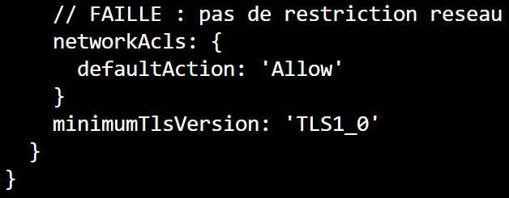

Q1.1 C'est une faille qui se rattache au pilier réseau

On enchaine avec une très grosse faille : l'accès en SSH (Secure Shell)
n'est pas restreint, n'importe qui peut se connecter en SSH via le port
par défaut 22 et donc prendre le contrôle du système. Il est également
important de noter que la priorité est de 100 ce qui signifie qu'elle
prend le dessus sur d'autres règles du groupe de sécurité réseau et donc
impossible de la limiter via une autre règle plus sécurisée. Cette
faille concerne le trafic entrant via la direction 'Inbound'.

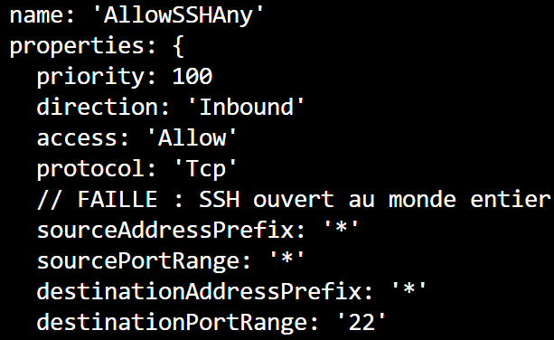

Q1.1 C'est une faille qui se rattache au pilier exposition

Toujours dans l'accès à distance une autre faille est présente : le RDP
pour Remote Desktop Protocol, cela permet d'avoir accès encore une fois
au système à distance ce qui est très grave et une faille de sécurité
évidente :

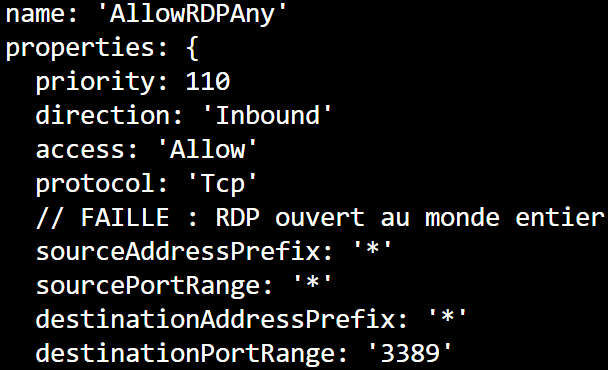

Comme pour le SSH n'importe qui peut se connecter via le trafic entrant,
la priorité est réglée sur 110 donc elle est moins prioritaire que le
SSH mais même chose, elle prend donc l'ascendant sur d'autres règle de
sécurité qui n'ont pas de priorité indiquée.

Q1.1 C'est une faille qui se rattache au pilier exposition

Comme indiqué pour l'instant il n'y a aucun système de tags dans le code
source, on ne sait pas ce qui correspond à quoi et donc ça rend le
processus de gouvernance impossible en l'état actuel.

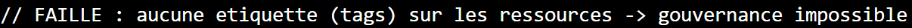

Q1.1 C'est une faille qui se rattache au pilier gouvernance

Q5 : Avertissements du linter

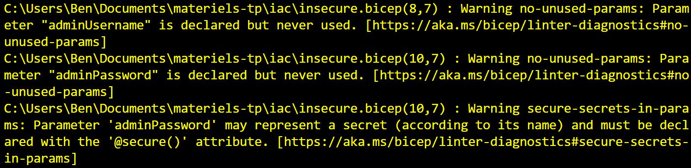

Plusieurs avertissements sont à notés :

Les logins sont mis en clair via la fonction no-unused-parameter que ça
soit pour adminUsername ou adminPassword

Également on a un avertissement comme quoi adminPassword pourrait
représenter un secret ce qui est vrai et qu'il faudrait la déclarer via
l'attribut secure()

1.2 -- Durcissement du Bicep

On crée une copie de insecure.bicep qui s'appellera secure.bicep, dans
ce fichier plusieurs remédiations vont être effectuer :

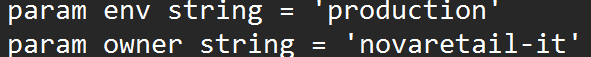

Dans un premier temps on déclarer les deux chaines de caractères env et
string

Ensuite on déclare le paramètre adminPassword puis @secure() mais sans
indiqué le mot de passe, de cette manière il n'est pas en clair et
lorsqu'on en aura besoin, il faudra simplement le renseigner.

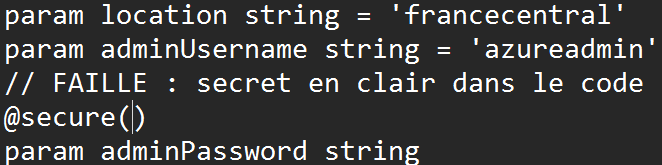

Pour continuer dans la partie compte de stockage on modifie plusieurs
paramètres :

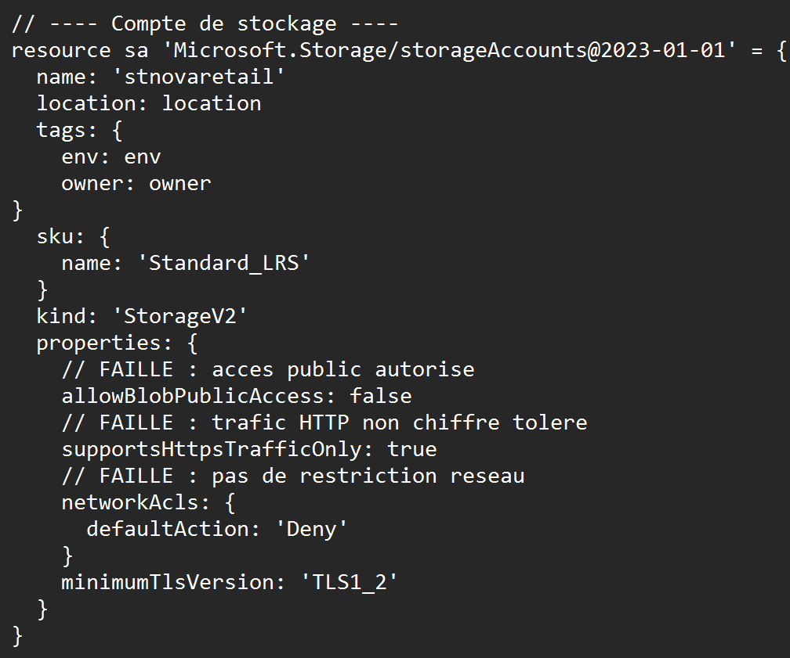

On rajoute les tags env et owner, la fonction « allowBlobPublicAccess »
passe de true à false, supportsHttpsTrafficOnly passe de false à true
pour forcer la connexion en HTTPS

defaultAction passe de Allow à Deny et finalement la version minimum de
TLS est mise en 1.2 au lieu de 1.0

Pour la partie réseau on corrige les éléments suivants :

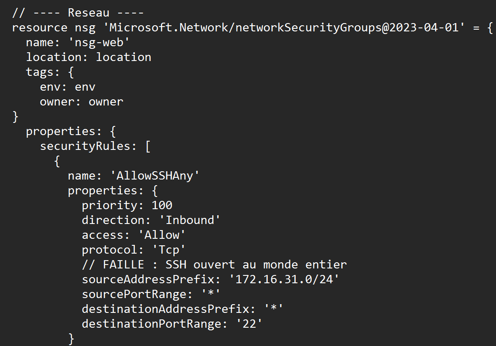

On ajoute une nouvelle fois les tags env et owner

Puis côté SSH on ajouter une plage d'adresse pour éviter que n'importe
qui puisse se connecter

Côté RDP même chose on laisse le port par défaut et on définit une plage
d'adresse :

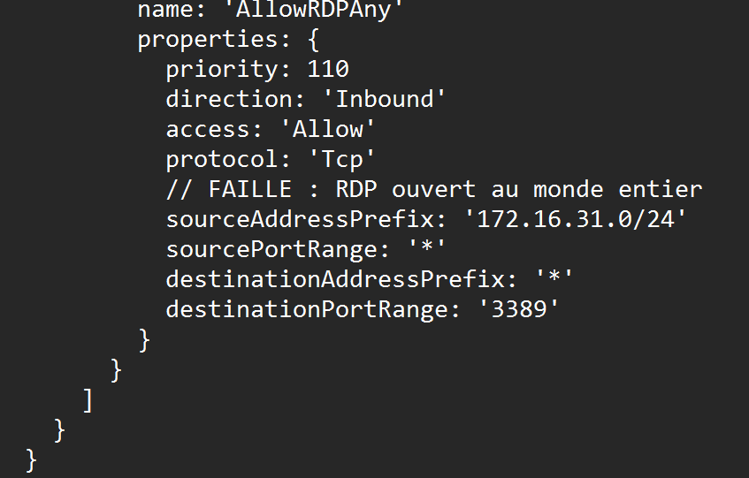

Finalement pour le réseau virtuel on ajoute les tags :

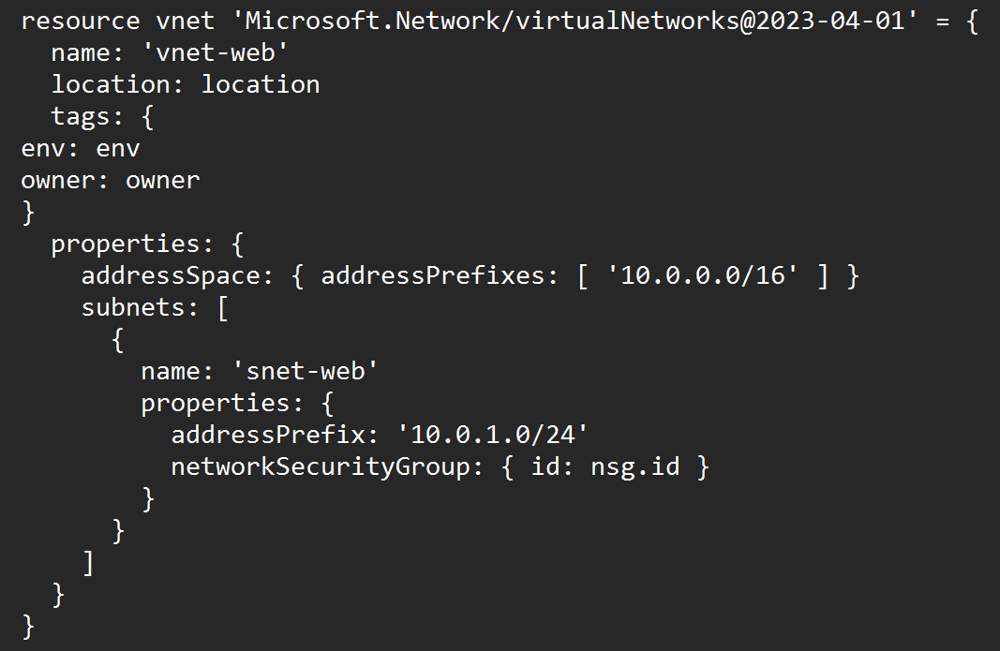

Si on effectue de nouveau la commande build on obtient seulement deux
avertissements mais c'est normal puisque nous n'avons pas encore modifié
ces éléments :

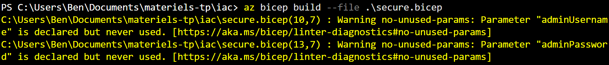

Q1.3 Différence entre les effets

Audit : génère une alerte dans les journaux de conformité sans bloquer
l'action.

Deny : Bloque immédiatement la création ou la modification de la
ressource si elle ne respecte pas la règle

DeployIfNotExists : Vérifie l'état d'une ressource et déploie
automatiquement un composant correctif si la règle n'est pas respectée
(par exemple, activer les logs sur un compte de stockage).

1.4 RBAC au moindre privilège

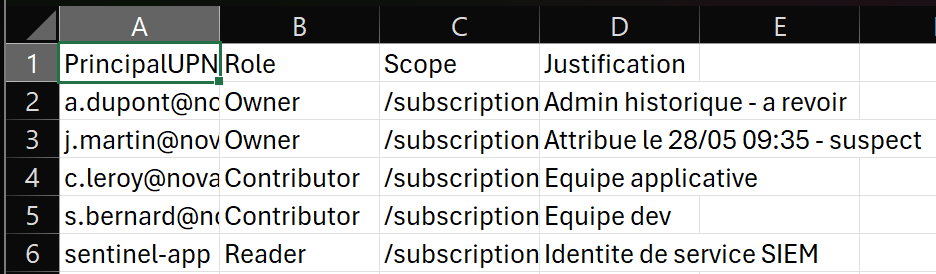

Voici les failles critiques relevées dans l'attribution des accès :

- **Périmètre trop large (Scope /subscription)** : La majorité des
  utilisateurs ont des droits sur toute l'infrastructure. C'est une
  violation directe du principe du moindre privilège ; ils devraient
  être limités uniquement aux groupes de ressources dont ils ont besoin.

- **Abus du rôle Owner** : a.dupont et j.martin sont propriétaires de
  l'abonnement. Ce rôle est trop puissant, car il donne le contrôle
  total sur les ressources, mais aussi sur la gestion des accès (IAM) et
  la suppression des sécurités.

- **Escalade de privilèges suspecte** : L'attribution du rôle Owner à
  j.martin le 28/05 à 09 : 35 est anormale. C'est l'indicateur clé de
  l'intrusion, confirmant une tentative d'escalade de privilèges pour
  mener des actions malveillantes.

10.

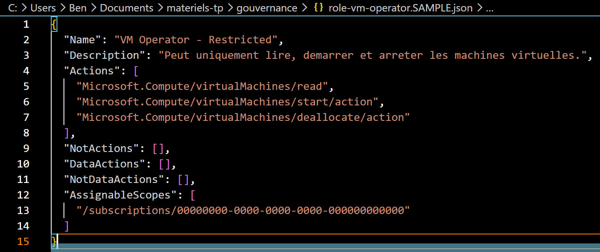

**Question Q1.4 : Quel est le rapport entre l'attribution suspecte de
la table et ce que vous trouverez au module 3 ?**

Réponse : L'attribution du rôle Owner à j.martin@novaretail le 28/05 à
09:35 constitue l'indicateur principal d'une escalade de privilèges
malveillante. Dans le module 3, nous verrons que ce compte est celui qui
est utilisé pour mener les actions illégitimes (comme la modification de
ressources ou la création de persistance) une fois que l'attaquant a
réussi à compromettre ses identifiants et à obtenir des droits élevés.

## 2. Defender for cloud : posture

  --------------------------------------------------------------------------------------
  **ID**      **Catégorie**   **Sévérité**   **Impact sur l'intrusion**  **Priorité**
  ----------- --------------- -------------- ---------------------------- --------------
  **R-004**   Identité        Critique       Bloque l'accès initial      1
                                             (MFA)                        

  **R-001**   Accès Réseau    Haute          Bloque l'accès distant non  1
                                             sécurisé (JIT)               

  **R-002**   Stockage        Haute          Empêche l'exposition des    2
                                             données                      

  **R-003**   Réseau          Haute          Réduit la surface d'attaque 2
                                             (NSG)                        

  **R-005**   Monitoring      Moyenne        Améliore la détection des    3
                                             menaces                      

  **R-006**   Audit           Moyenne        Assure la traçabilité des    3
                                             actions                      

  **R-007**   Chiffrement     Faible         Protection des données au    4
                                             repos                        

  **R-008**   Conformité      Faible         Alignement avec les          4
                                             standards                    
  --------------------------------------------------------------------------------------

Q2.1 : Le Secure Score mesure le pourcentage de conformité de
l'infrastructure par rapport aux meilleures pratiques de sécurité.

Un score de 38 % est un signal d'alerte critique, indiquant que plus de
60 % des contrôles de base ne sont pas activés, exposant ainsi
l'entreprise à des risques élevés de compromission.

2.2

  -----------------------------------------------------------------------------
  **Recommandation**   **Responsabilité**   **Justification**
  -------------------- -------------------- -----------------------------------
  **R-001 (JIT)**      **Client**           La gestion des accès réseau aux VMs
                                            est une configuration client.

  **R-002 (Stockage)** **Client**           La sécurisation des comptes de
                                            stockage est une responsabilité de
                                            configuration client.

  **R-003              **Client**           Les règles de filtrage réseau (NSG)
  (Réseau/NSG)**                            sont à la charge du client.

  **R-004              **Client**           La gestion des identités et des
  (MFA/Identité)**                          accès (IAM) est toujours sous la
                                            responsabilité du client.

  **R-005              **Client**           La configuration des alertes et du
  (Monitoring)**                            monitoring sur tes ressources
                                            t'incombe.

  **R-006 (Audit)**    **Client**           L'activation et la revue des logs
                                            d'activité sont des tâches client.

  **R-007              **Client**           Le chiffrement des données au repos
  (Chiffrement)**                           est une option de configuration
                                            client.

  **R-008              **Partagée**         Le cadre est fourni par Microsoft,
  (Conformité)**                            mais son application est une tâche
                                            client.
  -----------------------------------------------------------------------------

Q2.2

**R-004 (MFA - Authentification Multi-Facteurs) :** C'est cette mesure
qui aurait **bloqué l'accès initial**. Même si l'attaquant avait
réussi à récupérer ou deviner le mot de passe du compte j.martin,
l'absence de ce deuxième facteur de validation aurait empêché la
finalisation de la connexion, stoppant l'attaque avant même qu'elle ne
commence.

**R-001 (JIT - Just-In-Time VM Access) :** Cette mesure est une défense
en profondeur qui aurait limité la surface d'attaque après
l'authentification.

Elle permet de restreindre l'accès aux ports d'administration
(SSH/RDP) uniquement sur demande et pour une durée limitée. Dans le
contexte de cette intrusion, elle aurait empêché l'attaquant de
maintenir un accès réseau persistant vers les machines virtuelles une
fois qu'il a cherché à se déplacer latéralement.

**Question Q2.3 :** À quel cadre (ex. Microsoft Cloud Security
Benchmark) rattacheriez-vous le contrôle « Restreindre l'accès réseau »
? Comment ajouterait-on ISO 27001 ou RGPD au suivi ?

**1. Cadre pour le contrôle « Restreindre l'accès réseau »**

Le contrôle « Restreindre l'accès réseau » se rattache directement au
**Microsoft Cloud Security Benchmark (MCSB)**. Dans ce cadre, il est
généralement classé sous le domaine de la **Sécurité Réseau** (ou
*Network Security*), qui vise à protéger les ressources contre les accès
non autorisés en appliquant le principe du moindre privilège aux flux
réseau.

**2. Ajout de l'ISO 27001 ou du RGPD au suivi**

Pour intégrer des cadres comme l'ISO 27001 ou le RGPD à ton suivi de
conformité dans Azure, la méthode consiste à utiliser les outils de
gouvernance intégrés :

- **Microsoft Defender for Cloud (Regulatory Compliance Dashboard)** :
  Tu peux ajouter des "Regulatory Compliance standards" directement
  depuis le tableau de bord de conformité.

- **Application des standards** :

  - En sélectionnant l'**ISO 27001** ou le **RGPD** dans les paramètres
    de conformité, Azure va automatiquement mapper tes ressources et tes
    contrôles (comme le contrôle d'accès réseau) aux exigences
    spécifiques de ces cadres.

  - Le tableau de bord affichera alors ton score de conformité
    spécifique pour chaque cadre ajouté, en identifiant les contrôles
    réussis et ceux nécessitant une remédiation.

## Module 3 - Détection KQL avec Microsoft Sentinel

### 3.1 - Fondamentaux KQL

Écrivez les requêtes KQL répondant à :

- a) Les 20 dernières lignes de `SigninLogs`, colonnes utiles
  uniquement.

```kql
SigninLogs
| project TimeGenerated, UserPrincipalName, IPAddress, ResultType
| top 20 by TimeGenerated desc
```

- b) Le nombre de connexions par `UserPrincipalName`, trié
  décroissant.

```kql
SigninLogs
| summarize NbConnexions = count() by UserPrincipalName
| sort by NbConnexions desc
```

- c) Les alertes `SecurityAlert` groupées par `AlertSeverity`.

```kql
SecurityAlert | summarize Nombre = count() by AlertSeverity
```

**Question Q3.1 :** Rôle de `where`, `project`, `summarize`,
`sort` ; différence `take` vs `top`.

**where** : Filtre les lignes pour ne garder que celles qui répondent à
une condition spécifique.

**project** : Sélectionne les colonnes à afficher, permettant de
nettoyer l'affichage des données brutes.

**summarize** : Effectue des calculs d'agrégation (compter des
éléments, sommer des valeurs) sur un ensemble de données.

**sort** : Trie les résultats selon une colonne donnée.

**take vs top** :

- **take** (ou limit) renvoie un nombre de lignes arbitraire sans ordre
  précis.

- **top** effectue d'abord un **tri** avant de limiter le nombre de
  lignes, ce qui est indispensable pour extraire les données les plus
  récentes ou les valeurs les plus élevées.

### 3.2 - Détection : force brute + accès suspect

1.  Écrivez une requête qui détecte un compte ayant **plus de 5 échecs
    d'authentification** (`ResultType != 0`) dans une fenêtre de 15
    min, par utilisateur et IP.

```kql
// 1. Détecter les échecs (Force brute)
let bruteforce = SigninLogs
| where ResultType != 0
| summarize Echecs = count() by UserPrincipalName, IPAddress, bin(TimeGenerated, 15m)
| where Echecs > 5;

// 2. Associer avec un succès ultérieur
bruteforce
| join kind=inner (
    SigninLogs | where ResultType == 0
) on UserPrincipalName, IPAddress
| where TimeGenerated > TimeGenerated1
| project UserPrincipalName, IPAddress, Echecs, TimeGenerated1
```

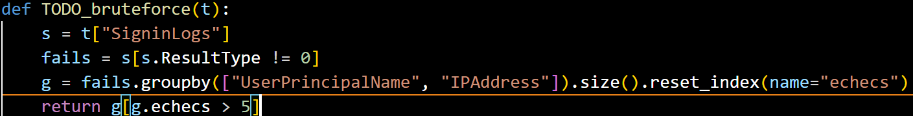

1.  Vérifiez : implémentez `TODO_bruteforce` dans `lab.py` et
    comparez à la sortie de référence (`python lab.py --check`).
    **Attendu : 8 échecs pour j.martin depuis 45.83.220.14.**


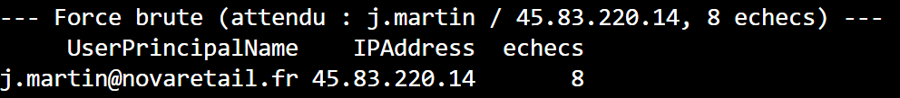

**Question Q3.2 :** Quel signal désigne ici un *impossible travel* ?
(indice : comparez 08:05 et 09:21).

Le signal d'**impossible travel** désigne une anomalie de connexion où
un même compte utilisateur effectue deux authentifications réussies à
partir de deux adresses IP situées dans des zones géographiques
distantes, dans un laps de temps trop court pour permettre un
déplacement physique réel entre ces deux points.

- **Analyse du cas j.martin :**

  - À **08:05**, une tentative de connexion est enregistrée depuis une
    IP donnée.

  - À **09:21**, une nouvelle connexion réussie est enregistrée depuis
    une autre localisation.

  - **Le signal d'alerte :** La distance géographique entre ces deux
    points de connexion est telle qu'il serait physiquement impossible
    pour l'utilisateur de s'y rendre en seulement 1 heure et 16
    minutes.

### 3.3 --- Détection : escalade de privilèges

1.  Écrivez la requête KQL détectant une **attribution de rôle réussie**
    dans `AzureActivity`.

```kql
AzureActivity
| where OperationNameValue has "roleAssignments/write"
| where ActivityStatusValue == "Success"
| project TimeGenerated, Caller, CallerIpAddress, ResourceGroup
```

2.  Vérifiez via `TODO_privesc`. **Attendu : 1 ligne, j.martin à
    09:35.** À quelle technique MITRE ATT&CK cela correspond-il ?

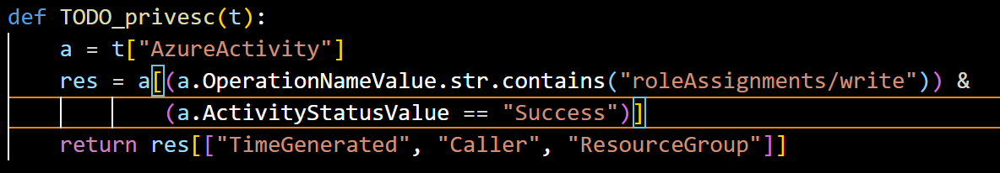

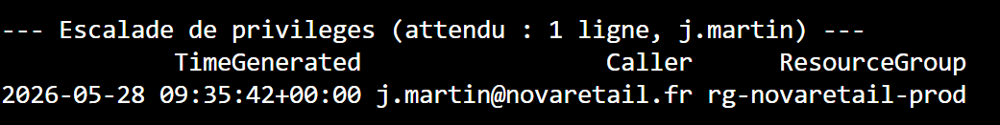

### 3.4 --- Formaliser une règle analytique Sentinel

```yaml
id: "8c42a1b9-3d12-4e99-87a4-123456789abc"
name: "Escalade de privilèges : Attribution de rôle suspecte"
description: "Détecte une modification de rôle (roleAssignments/write) réussie par un utilisateur."
severity: "High"
query: |
  AzureActivity
  | where OperationNameValue has "roleAssignments/write"
  | where ActivityStatusValue == "Success"
  | project TimeGenerated, Caller, CallerIpAddress, ResourceGroup, OperationNameValue
queryFrequency: 5m
queryPeriod: 5m
triggerOperator: GreaterThan
triggerThreshold: 0
tactics:
  - PrivilegeEscalation
techniques:
  - T1098
  - T1098.003
entityMappings:
  - entityType: Account
    fieldMappings:
      - identifier: FullName
        columnName: Caller
  - entityType: IP
    fieldMappings:
      - identifier: Address
        columnName: CallerIpAddress
```

**Question Q3.4 :** Pourquoi le mapping d'entités est-il indispensable
à l'investigation et à la corrélation dans Sentinel ? Que signifient
SIEM et SOAR ?

**1. Pourquoi le mapping d'entités est-il indispensable ?**

Le mapping d'entités est le "liant" qui permet à Microsoft Sentinel
de transformer des données brutes en informations exploitables. Il est
indispensable pour deux raisons majeures:

- **Corrélation automatique** : En identifiant explicitement que Caller
  est un *Compte* et CallerIpAddress est une *IP*, Sentinel peut lier
  automatiquement cette alerte avec d'autres événements provenant de
  sources totalement différentes (ex : logs de connexion, logs de
  pare-feu, logs d'applications). Sans ce mapping, le système voit des
  chaînes de caractères isolées ; avec, il voit une identité unique qui
  traverse tout ton système.

- **Investigation graphique** : Lors d'une enquête, Sentinel utilise ce
  mapping pour générer automatiquement un **graphique
  d'investigation**. Cela permet à l'analyste de voir visuellement
  tous les liens entre l'utilisateur compromis, les machines qu'il a
  touchées et les ressources Azure qu'il a modifiées, facilitant ainsi
  la compréhension de la portée de l'attaque.

**2. Que signifient SIEM et SOAR ?**

Ces deux outils sont complémentaires dans la gestion des opérations de
sécurité (SecOps) :

- **SIEM (Security Information and Event Management)** : C'est le
  **cerveau analytique**. Il collecte, centralise et analyse en temps
  réel les logs de toute l'infrastructure. Son rôle est de détecter les
  menaces via des règles analytiques (comme celles que tu as créées dans
  ce TP) et de fournir une vue d'ensemble sur la sécurité.

- **SOAR (Security Orchestration, Automation, and Response)** : C'est
  le **bras opérationnel**. Il permet d'automatiser les actions de
  réponse à la suite d'une alerte. Au lieu qu'un analyste doive bloquer
  manuellement un compte ou isoler une machine, le SOAR utilise des
  "Playbooks" pour exécuter ces actions instantanément, réduisant
  ainsi le temps de réponse (MTTR - *Mean Time To Respond*).

## 5. Azure Monitor & Log Analytics

### 5.1 --- Disponibilité des hôtes

1.  Écrivez une requête KQL sur `Heartbeat` donnant la **dernière
    vue** de chaque machine, et signalant celles silencieuses depuis
    plus de 30 min.

```kql
Heartbeat
| summarize DerniereVue = max(TimeGenerated) by Computer
| extend TempsSilencieux = datetime_diff('minute', now(),
DerniereVue)
| where TempsSilencieux > 30
| sort by DerniereVue asc
```

2.  Vérifiez via `TODO_offline_host`. **Quelle machine est tombée, et
    à quelle heure ?**

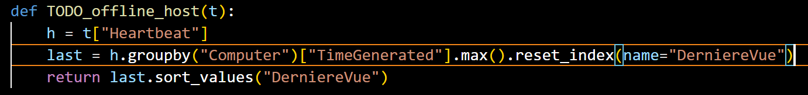

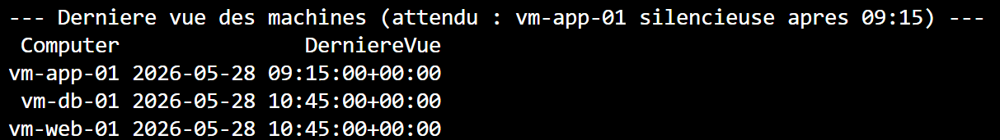

### 5.2 --- Performance & visualisation

3.  Écrivez une requête KQL sur `Perf` (`% Processor Time`) agrégée
    par tranche de 15 min et par machine, avec `render timechart`.

```kql
Perf
| where CounterName == "% Processor Time"
| summarize AvgCPU = avg(CounterValue) by bin(TimeGenerated, 15m),
Computer
| render timechart
```

**Question Q4.2 :** À quel moment `vm-web-01` est-elle en surcharge ?
Que font `bin()` et `render` ?

**Réponse à la Question Q4.2**

**1. À quel moment vm-web-01 est-elle en surcharge ?** D'après
l'analyse des données de performance (et la visualisation graphique),
la machine vm-web-01 présente un pic de surcharge significatif
(utilisation CPU élevée) situé dans la tranche horaire **10:15 -
10:30**.

**2. Que font bin() et render ?**

- **bin()** : Cet opérateur regroupe les données par intervalles de
  temps définis (ici, des tranches de 15 minutes). Cela permet de lisser
  les données brutes pour mieux identifier les tendances temporelles
  plutôt que de se perdre dans des variations à la seconde près.

- **render** : Cette commande transforme le tableau de résultats KQL en
  une représentation visuelle (graphique). Le paramètre timechart génère
  spécifiquement un graphique chronologique, essentiel pour repérer
  visuellement les pics de charge et les anomalies de performance sur
  une période donnée.

### 5.3 Conception d'alertes

4.  Concevez **deux alertes** : (a) une alerte **de métrique** CPU > 80
    % ; (b) une alerte **de recherche dans les journaux** (KQL) sur
    l'échec de heartbeat. Décrivez le groupe d'actions.

**1. Conception des alertes**

- **(a) Alerte de métrique CPU > 80 %** :

  - **Type** : Alerte de métrique (Azure Monitor).

  - **Condition** : Percentage CPU > 80 % sur une période agrégée de 5
    minutes.

- **(b) Alerte de recherche dans les journaux (KQL)** :

  - **Type** : Alerte de journal (Log Analytics).

  - **Requête** :

```kql
Heartbeat
| where TimeGenerated > ago(30m)
| summarize LastCall = max(TimeGenerated) by Computer
| where LastCall < ago(10m)
```

**Description du Groupe d'actions**

Le **groupe d'actions** est une ressource Azure essentielle qui définit
"qui" est notifié et "quoi" est exécuté lorsqu'une alerte est
déclenchée. Il permet de structurer la réponse opérationnelle de la
manière suivante :

- **Notifications** : Envoi d'alertes ciblées aux administrateurs ou
  aux équipes SOC via différents canaux comme l'e-mail, les SMS, les
  notifications Push (via l'application Azure), ou des appels vocaux.

- **Actions automatisées (Remédiation)** : Déclenchement automatique de
  **Runbooks** Azure Automation pour effectuer des tâches correctives
  sans intervention humaine, comme le redémarrage d'une instance
  vm-app-01 défaillante, l'isolation réseau d'une machine compromise,
  ou l'ajustement dynamique de la capacité (autoscaling) en cas de
  surcharge CPU prolongée.

**Question Q4.3 :** Différence entre alerte de **métrique** et alerte de
**recherche dans les journaux** ? Avantages/inconvénients.

**Réponse à la Question Q4.3 : Métriques vs Journaux**

La différence fondamentale réside dans la **nature de la donnée**
surveillée et le **temps de traitement**.

  ----------------------------------------------------------------------------
  **Caractéristique**   **Alerte de Métrique**    **Alerte de recherche
                                                  (Journaux)**
  --------------------- ------------------------- ----------------------------
  **Type de données**   Numériques (CPU, RAM,     Texte, logs d'événements,
                        débit réseau).            traces système.

  **Granularité**       Très précise, point dans  Basée sur une période
                        le temps.                 (fenêtre d'ingestion).

  **Complexité**        Basée sur des seuils      Basée sur des requêtes KQL
                        simples.                  complexes.
  ----------------------------------------------------------------------------

## 6. Synthèse : reconstituer l'intrusion

En croisant **toutes** les tables, reconstituez l'attaque subie par
NovaRetail le 28/05.

1.  **Chronologie** --- établissez la timeline des événements (Signin →
    Activity → Alert) du compte compromis.

  ----------------------------------------------------------------------------
  **Heure**     **Événement**      **Détails**
  ------------- ------------------ -------------------------------------------
  **08:05**     Tentative de force Début des échecs de connexion (IP :
                brute              45.83.220.14).

  **09:21**     Succès de          Connexion réussie depuis la même IP
                connexion          (Compromission initiale).

  **09:35**     Escalade de        Attribution de rôle réussie
                privilèges         (roleAssignments/write) par j.martin.

  **~09:40**   Alerte de sécurité Déclenchement de l'alerte Sentinel
                                   corrélée.
  ----------------------------------------------------------------------------

2.  **Hunting** --- écrivez une requête KQL qui relie le **succès
    d'authentification depuis l'IP malveillante** aux **actions
    menées** par le même `Caller` dans `AzureActivity`.

```KQL
// 1. Définir l'IP malveillante détectée
let MaliciousIP = "45.83.220.14";

// 2. Identifier le compte compromis qui a réussi à se connecter depuis cette IP
let CompromisedAccount = SigninLogs
| where IPAddress == MaliciousIP and ResultType == 0
| summarize by UserPrincipalName;

// 3. Rechercher toutes les actions réalisées par ce compte dans AzureActivity
AzureActivity
| where Caller in (CompromisedAccount) or CallerIpAddress == MaliciousIP
| project TimeGenerated, Caller, CallerIpAddress, OperationNameValue, ActivityStatusValue, ResourceGroup
| sort by TimeGenerated asc
```

3.  **MITRE** --- mappez la chaîne complète (accès initial → escalade →
    persistance → collecte).

  --------------------------------------------------------------------------
  **Tactique**      **Technique     **Action observée**
                    (ID)**          
  ----------------- --------------- ----------------------------------------
  **Accès initial** **T1110**       Tentatives répétées d'authentification
                    (Brute Force)   sur le compte de j.martin depuis l'IP
                                    45.83.220.14.

  **Escalade de     **T1098.003**   Utilisation des accès compromis pour
  privilèges**      (Cloud Account  modifier des attributions de rôles Azure
                    Mod.)           (roleAssignments/write).

  **Persistance**   **T1136.003**   Création ou modification de permissions
                    (Cloud Account) pour maintenir un accès à long terme
                                    malgré une éventuelle réinitialisation
                                    du mot de passe.

  **Collecte**      **T1537**       (Hypothèse) L'accès aux ressources via
                    (Transfer Data  les nouveaux privilèges permet
                    to Cloud)       l'exfiltration ou l'accès aux données
                                    stockées.
  --------------------------------------------------------------------------

4.  **Remédiation & prévention** --- pour chaque étape, citez : la
    recommandation Defender qui aurait aidé, la politique Azure / le
    contrôle RBAC qui aurait prévenu, et la correction Bicep associée.

  -------------------------------------------------------------------------------------------------------
  **Étape de        **Recommandation   **Politique/Contrôle   **Correction Bicep (concept)**
  l'attaque**      Defender**         RBAC**                 
  ----------------- ------------------ ---------------------- -------------------------------------------
  **Accès initial** Activer MFA        Appliquer une          Microsoft.Authorization/policyAssignments
                    (Multi-Factor      politique d'accès     
                    Authentication).   conditionnel (MFA      
                                       obligatoire).          

  **Escalade**      Privileged         Principe du "moindre  Microsoft.Authorization/roleAssignments
                    Identity           privilège" (retirer   
                    Management (PIM).  Owner/Contributor).    

  **Persistance**   Surveillance des   Verrouillage des       Microsoft.Authorization/locks
                    changements de     ressources             
                    rôles.             (ResourceLocks).       

  **Collecte**      Analyse            Micro-segmentation     Microsoft.Network/networkSecurityGroups
                    comportementale    réseau (NSG/ASG).      
                    (UEBA).                                   
  -------------------------------------------------------------------------------------------------------

**Synthèse : Du SOC à la résilience (15-20 lignes)**

Le cycle de gestion des incidents, illustré par cette étude de cas,
repose sur une approche proactive et intégrée. **La détection** a débuté
par l'analyse des logs SigninLogs, révélant une attaque par force
brute. Cette alerte a déclenché une phase d'**investigation**
approfondie où la corrélation entre les échecs d'authentification et
l'activité Azure (AzureActivity) a permis de confirmer la compromission
du compte j.martin et d'identifier un *impossible travel*. Le passage à
l'étape de **remédiation** s'est traduit par la neutralisation de la
menace (révocation de sessions, blocage de l'IP et suppression des
rôles illégitimes).

Toutefois, la sécurité ne peut se limiter à la réaction ; elle exige une
**prévention** structurelle. Pour éviter la répétition de tels
scénarios, nous recommandons le déploiement systématique de
l'authentification multifacteur (MFA) via des politiques d'accès
conditionnel, qui aurait bloqué l'accès initial malgré la découverte du
mot de passe. De plus, l'utilisation de *Privileged Identity
Management* (PIM) et la mise en œuvre du principe du moindre privilège
via RBAC limitent drastiquement l'impact d'une escalade de privilèges
en cas de compte compromis. Enfin, l'automatisation de
l'infrastructure via le code (Bicep) garantit que les contrôles de
sécurité, tels que les verrous de ressources (ResourceLocks) ou les
politiques de conformité, sont appliqués de manière uniforme et
auditable dès le déploiement. En bouclant cette boucle de rétroaction
--- de la détection à l'amélioration continue des politiques ---
l'organisation passe d'une posture défensive subie à une résilience
architecturale robuste, capable d'anticiper et de neutraliser les
vecteurs d'attaque modernes avant qu'ils ne deviennent des incidents
majeurs.
