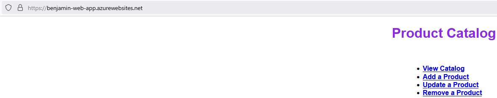
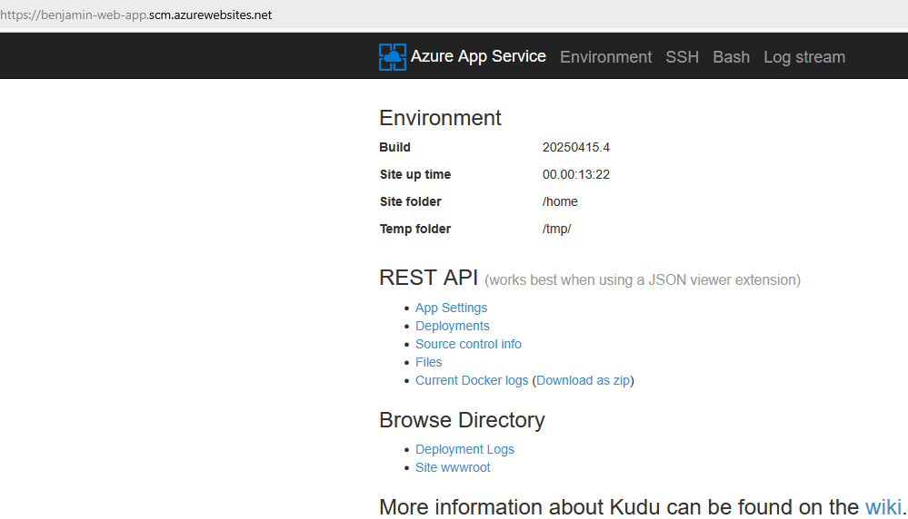

# Déploiement d'une Application Web sur Azure (CLI vs Terraform)

!!! info "Contexte du projet (Méthode STAR)"
    * **Situation** : Nécessité de déployer une application web "Product Catalog" sur le cloud Microsoft Azure.
    * **Tâche** : Comparer deux approches de déploiement : une approche impérative et manuelle via la CLI Azure, et une approche déclarative et automatisée par Infrastructure as Code (IaC) avec **Terraform**.
    * **Action** : Création manuelle d'une App Service via la ligne de commande, puis écriture des configurations Terraform (`terraform init`, `plan`, `apply`) pour provisionner et déployer l'ensemble de l'infrastructure de manière reproductible.
    * **Résultat** : Déploiement réussi dans les deux cas, démontrant la supériorité d'une démarche IaC pour la robustesse et la rapidité de recréation de l'infrastructure.

Le but de ce TP était de déployer une application web "Product Catalog" sur Azure de deux manières différentes : d'abord manuellement avec la ligne de commande (CLI), puis en automatisant le processus avec l'outil Terraform.

## 1. Déploiement avec la CLI Azure

J'ai commencé par le déploiement manuel pour bien comprendre les ressources nécessaires. En utilisant les commandes de la CLI Azure, j'ai créé une App Service et déployé le code de l'application.


*Résultat de la page d'accueil de l'application, accessible en ligne.*


*Environnement d'exécution de l'application sur Azure App Service (build, temps de fonctionnement et accès aux logs).*

## 2. Automatisation avec Terraform

La seconde partie du TP visait à automatiser le processus de déploiement à l'aide de Terraform.

### Extrait de configuration IaC
```hcl
provider "azurerm" {
  features {}
}

resource "azurerm_resource_group" "rg" {
  name     = "rg-product-catalog"
  location = "France Central"
}
```

Étapes de déploiement
J'ai d'abord dû initialiser mon projet avec la commande terraform init. Cette étape est obligatoire, elle prépare Terraform et télécharge le "connecteur" pour Azure. Le message de succès montre que tout est prêt pour la suite.

Ensuite, j'ai lancé la commande terraform plan. C'est une étape qui simule ce qui va se passer. Terraform m'a montré toutes les ressources qu'il allait créer sur Azure. Ça permet de vérifier qu'il n'y a pas d'erreur dans le code avant de lancer l'application pour de vrai.

Une fois le plan vérifié, j'ai exécuté terraform apply. C'est cette commande qui a réellement créé toutes les ressources (le groupe de ressources, l'App Service, etc.) sur mon compte Azure.

Enfin, cette capture montre le résultat final. L'application est de nouveau en ligne, mais cette fois déployée par Terraform. On peut voir la donnée "Test Terraform", ce qui prouve que c'est bien la version gérée par mon code Terraform qui est en place.

## 3. Conclusion
Ce TP était très formateur pour comparer les deux approches. La méthode CLI est directe mais devient vite fastidieuse si on doit refaire le déploiement plusieurs fois.

L'approche avec Terraform est beaucoup plus robuste. Même si la préparation des fichiers .tf demande un peu de temps au début, une fois que c'est fait, on peut détruire et recréer toute l'infrastructure à l'identique avec une seule commande.
