# Déploiement & Sécurisation d'un Cluster Docker Swarm

!!! info "Contexte du projet (Méthode STAR)"
    * **Situation** : Nécessité de déployer une infrastructure de conteneurs distribuée et hautement disponible, tout en garantissant la sécurité des communications inter-nœuds.
    * **Tâche** : Monter un cluster Docker Swarm de 3 nœuds (1 Manager, 2 Workers) sous Alpine Linux, déployer des services répliqués, intégrer la supervision avec Portainer et durcir la sécurité.
    * **Action** : Configuration du réseau overlay chiffré (`--opt encrypted`), activation du verouillage automatique des clés (`--autolock=true`), déploiement d'une stack Portainer en YAML et audit du trafic via `tcpdump`.
    * **Résultat** : Un cluster opérationnel, supervisé visuellement et protégé contre l'interception de trafic et le vol de clés en mémoire au redémarrage.

## 1. Introduction & Préparation des VMs

Le but de ce TP est de créer un cluster à l'aide de Swarm basé sur
trois machines alpines Linux.

Ce rapport détaillera chaque étape de ce TP en commençant par la
création de nos différentes VM, en passant par l'installation de Docker
sur nos différentes machines, la création du cluster Swarm et l'ajout
de nos différents workers, l'installation d'un service sur le cluster
et en finissant par l'ajout de Portainer dans le cluster et une
conclusion.

L'objectif de ce cluster est de pouvoir mieux comprendre le
fonctionnement d'un cluster (Comment est-ce que l'on peut mettre cela en
place, comment installer des services sur un cluster ? Comment protéger
un cluster ?)

J'ai choisi Swarm car il est plus léger, rapide et simple à déployer,
contrairement à des solutions plus puissantes mais complexes comme
Kubernetes.

Swarm est idéal pour mettre en place un cluster léger avec nos 3
machines

J'ai choisi Alpine Linux comme distribution pour mes machines virtuelle
car c'est une distribution très légère et simple à configurer.

De plus, Alpine fonctionne très bien avec Docker pour créer des images
légères et rapides, ce qui en fait un excellent choix pour notre
cluster.

### 1.1 Création des machines virtuelles :**

Dans un premier temps nous allons créer trois machines virtuelles qui
seront basées sur la distribution Linux alpine

Pour mettre en place ces machines virtuelles nous avons récupéré une OVA
(Open Virtual Appliance) de notre formateur M. Franck Soubières.

L'**OVA** est une version compressée et encapsulée d'un **OVF**. Plutôt
que d'avoir plusieurs fichiers séparés, tout est regroupé dans un seul
fichier **.ova** (qui est en fait une simple archive TAR contenant les
fichiers OVF, VMDK, MF, etc.).

L'**OVF** est un format standard ouvert pour le packaging et la
distribution de machines virtuelles. Il permet de décrire la
configuration d'une machine virtuelle (VM) de manière portable et
indépendante d'un hyperviseur spécifique (VMware, VirtualBox, Hyper-V,
etc.)

Un fichier OVF est en réalité un dossier contenant plusieurs fichiers :

- **.ovf** : un fichier XML décrivant la configuration de la VM (Mémoire
  vive, Nombre de CPU, disque, réseau, etc.).

- **.vmdk** : le ou les fichiers contenant l'image du disque dur de la
  VM.

- **.mf** (Manifest) : contient des checksums (somme de contrôle) pour
  vérifier l'intégrité des fichiers.

- **.cert** (optionnel) : certificat pour signer l'OVF et garantir son
  authenticité.

L'hyperviseur utilisé sera le logiciel VMWare Workstation

Pour créer les machines virtuelles nous allons nous rendre dans notre
hyperviseur puis utiliser la fonctionnalité ouvrir, à partir de là il
nous reste plus qu'à sélectionner notre fichier en .ova pour créer la
machine virtuelle alpine :

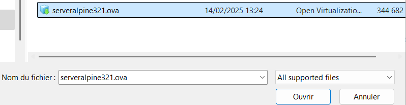

Ensuite une nouvelle fenêtre va apparaître nous demandant d'indiquer le
nom de notre nouvelle machine virtuelle :

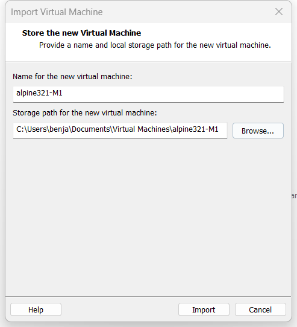

Ainsi, la machine virtuelle est bien créée :

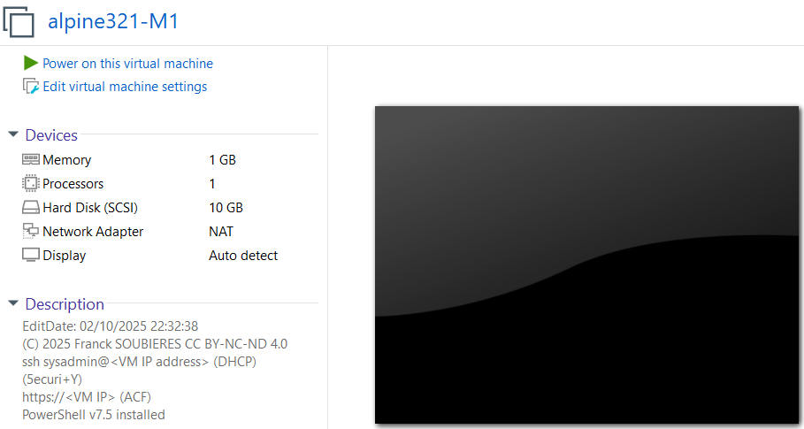

Il ne nous reste plus qu'à créer deux autres machines alpines pour mener
à bien ce TP, nous allons avoir besoin d'une première machine (Manager)
et de deux autres machines (Workers) qui seront affiliées à ce manager.

Notre machine manager est déjà créé, il ne nous reste plus qu'à créer
nos workers :

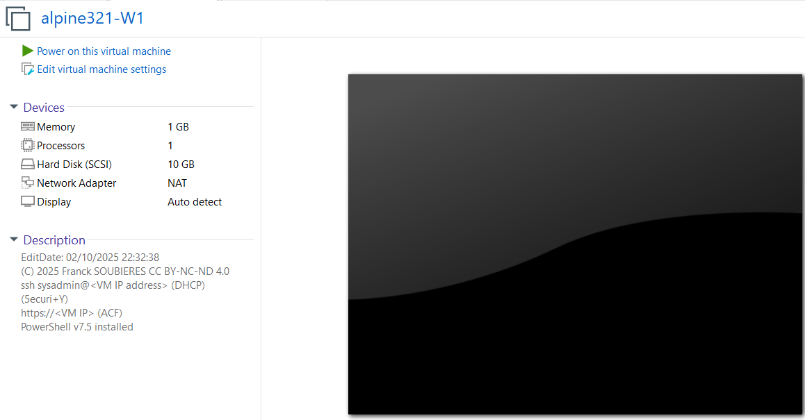

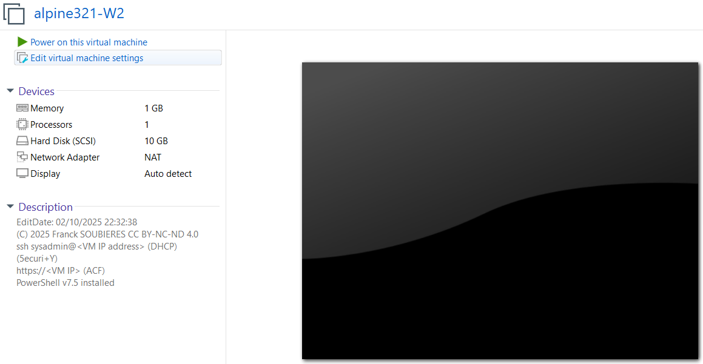

Ainsi nos trois VM sont ainsi bien créées.

### 1.2 Erreur AMD-V/RVI :

Dans mon cas précis, lorsque je vais essayer de lancer l'une des
machines virtuelles, je vais obtenir le message d'informations suivant :

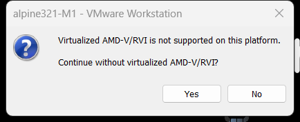

Ainsi qu'une erreur si je clique sur le bouton yes :

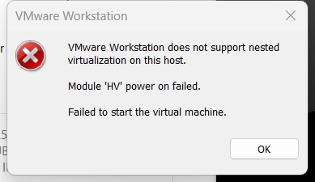

Ce problème vient du fait que je possède un processeur AMD sur mon
ordinateur portable et que la virtualisation imbriquée (**Nested
Virtualization**) n'est pas prise en charge ou activée sur ma machine.

Pour pouvoir tout de même lancer mes différentes machines virtuelles, je
vais me rendre dans les paramètres de mes machines

Puis, dans la partie processeur, je vais décocher l'option suivante :

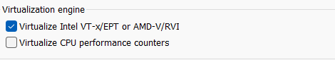

Ainsi je pourrais tout de même lancer mes VMs au prix d'une moins bonne
optimisation sur l'hyperviseur

## 2. Installation & Configuration de Docker sur Alpine

### 2.1 Lancement et connexion aux machines

Après avoir lancé une machine, pour se connecter, on va nous demander un
nom d'utilisateur ainsi qu'un mot de passe

Ces données confidentielles sont les suivantes :

Nom d'utilisateur : "sysadmin"

Mot de Passe : "5ecuri+Y"

Après s'être authentifié, le message suivant va s'afficher :

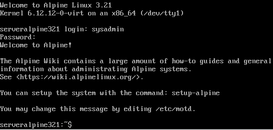

Nous pouvons désormais passer à l'installation de Docker

### 2.2 Installation et lancement de Docker :

Pour débuter cette étape nous allons écrire la commande **sudo apk
update** pour mettre à jour la liste des paquets disponible dans les
dépôts :

```bash
sudo apk update
```

À noter : apk update ne met pas nos paquets installés à jour, il met
juste à jour la liste des versions disponible. C'est pour cela que nous
allons enchaîner avec la commande **sudo apk upgrade** pour mettre à
jour nos différents paquets installés :

```bash
sudo apk upgrade
```

Une fois que nous sommes sûr d'avoir nos paquets installés à jour nous
pouvons passer à l'installation de Docker

Pour l'installer, on va écrire la commande suivante :

```bash
sudo apk add docker
```

Décomposition de la commande :

- sudo ->Exécute la commande avec les privilèges admin (sinon,
  l'installation sera refusée).

- apk -> Utilise Alpine Package Keeper, le gestionnaire de paquets
  d'Alpine Linux (équivalent de apt sur Debian ou dnf sur fedora par
  exemple).

- add -> Indique qu'on veut installer un paquet.

- docker ->Nom du paquet à installer**.**

La commande va installer Docker ainsi que ses dépendances et elle va
également configurer certains fichiers nécessaires au bon fonctionnement
de Docker.

Pour vérifier que Docker est bien installé sur notre machine on peut
utiliser la commande **docker --version** :

```bash
docker --version
```

Cette commande nous prouve que Docker est bien installé sur notre
système et affiche également la version de Docker installé.

Une fois Docker installé, nous allons désormais le démarrer

Pour démarrer le service Docker, nous allons écrire dans notre terminal
la commande suivante :

```bash
sudo rc-service docker start
```

Ainsi notre service Docker est bien démarré

Pour que le service Docker puisse se lancer au démarrage de notre
système nous allons taper dans le terminal la commande suivante :

```bash
sudo rc-update add docker
```

Pour finir, nous pouvons utiliser la commande **docker info** pour
obtenir des infos détaillées sur l'installation et la configuration de
notre docker :

```bash
docker info
```

### 2.3 Ajout du compte sysadmin dans le groupe docker 

L'erreur que nous obtenons dans la partie "**Server**" provient du fait
que le compte utilisateur que nous utilisons actuellement n'est pas dans
le groupe docker

Pour vérifier quel compte nous utilisons actuellement on va taper la
commande **whoami** qui permet de connaître notre nom d'utilisateur :

```bash
whoami
```

Nous sommes donc connectés en tant que l'utilisateur **sysadmin**

Pour l'ajouter au groupe docker on va taper la commande suivante :

```bash
sudo addgroup $(sysadmin) docker
```

Malheureusement nous obtenons l'erreur **addgroup : group 'docker' in
use.** Cela signifie qu'un groupe docker est déjà créé et donc nous ne
pouvons utiliser cette commande pour ajouter un nouvel utilisateur.

Nous ne pouvons pas non plus utiliser la commande usermod car elle n'est
pas disponible sur la distribution alpine.

Nous allons donc devoir modifier les fichiers de configuration des
groupes dans un éditeur de texte

On va taper la commande suivante :

```bash
sudo nano /etc/group
```

Pour pouvoir ouvrir le fichier /etc/group dans un éditeur de texte et
ainsi pouvoir modifier ses propriétés

Lorsque nous ouvrons le fichier en question, on se retrouve avec un
fichier contenant tous les groupes présents sur notre système :

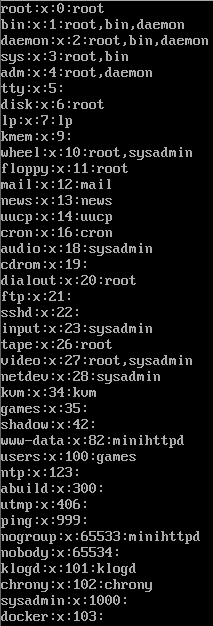

On va ainsi se rendre tous en bas du fichier dans la partie docker pour
y ajouter notre utilisateur qui s'appelle **sysadmin :**

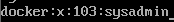

Il ne reste plus qu'à sauvegarder les changements :


Puis, à quitter le fichier :


Pour appliquer nos changements, nous allons redémarrer notre machine :

```bash
sudo reboot now
```

Pour vérifier que notre utilisateur est désormais bien dans le groupe
docker nous allons taper la commande groups suivi de notre nom
d'utilisateur :

```bash
groups sysadmin
```

Notre utilisateur sysadmin est donc bien désormais présent dans le
groupe docker. Si nous retapons la commande docker info nous ne devrions
plus avoir de message d'erreur :

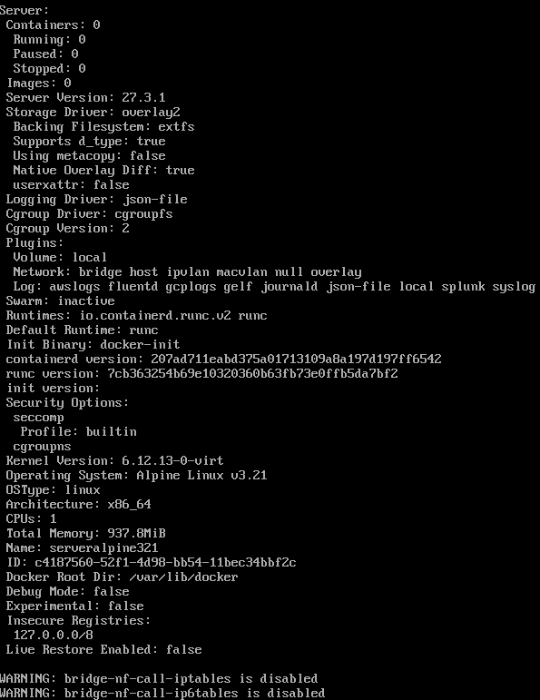

Nous pouvons exécuter la commande **docker run hello-world** pour être
sûr que notre Docker fonctionne correctement et que nous pouvons générer
et utiliser des conteneurs :

```bash
docker run hello-world
```

Ainsi le logiciel Docker est bien installé sur notre machine manager, il
nous reste plus qu'à faire de même sur les deux machines workers :

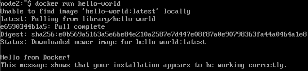

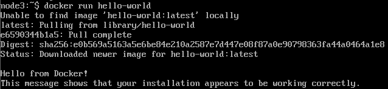

## 3. Renommage des Hôtes & Préparation Réseau

Avant de mettre en place le cluster et d'y ajouter nos trois machines
nous allons les renommer, ce qui nous permettra de les distinguer par la
suite

Notre machine manager sera ainsi renommée node1 et nos deux autres
machines seront renommées respectivement node2 et node3.

Pour faire ceci, on va taper la commande suivante dans le terminal :

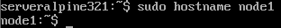
Pour être sûr que la modification du nom de la machine est permanente,
nous allons ouvrir le fichier /etc/hostname à l'aide de l'éditeur de
texte nano :


Dans ce fichier, nous allons voir le nom de notre machine de base :

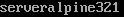

Que nous allons modifier en :


Il ne nous reste plus qu'à sauvegarder et quitter

Pour finir, il faudra reboot la machine pour être sûr que tous les
changements ont bien été appliqués :


La même chose sera appliquée sur les deux machines workers pour
différencier chaque machine :

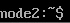


## 4. Initialisation & Jonction du Cluster Swarm

### 4.1 : Initialisation du cluster SWARM 

Pour initialiser Swarm sur notre machine manager nous avons besoin de
connaître notre adresse IP, c'est pour cela que nous allons utiliser la
commande **ifconfig :**

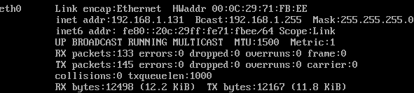

Nous pouvons voir que l'adresse IP de notre machine manager est
192.168.1.131

Nous pouvons maintenant initialiser Swarm sur notre machine manager avec
la commande suivante 
docker swarm init --advertise-addr adresse_IP_machine :

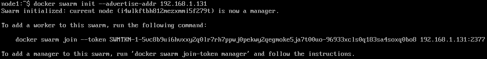

Ainsi notre cluster Swarm est bien initialisé il nous reste plus qu'à
rajouter nos workers à l'aide de la commande suivi d'un token qui nous
est affiché dans le terminal

### 4.2 : Ajouts de nos workers sur le cluster :

Pour cette étape nous allons nous connecter à l'aide du protocole SSH à
notre machine manager puis à nos deux machines worker, cela nous
permettra de copier la commande pour ajouter un worker au cluster puis
de la coller sur les machines worker sans avoir à taper la commande
manuellement avec le token, ce qui serait très long et fastidieux

Pour cette étape, il va nous falloir l'adresse IP de nos deux machines
worker :

Adresse IP de notre machine Manager : 192.168.1.131 :


Adresse IP de notre machine Worker1 : 192.168.1.132 :

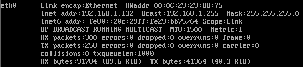

Adresse IP de notre machine Worker2 : 192.168.1.133 :


Dans le logiciel on va donc taper l'adresse IP de notre machine manager
:

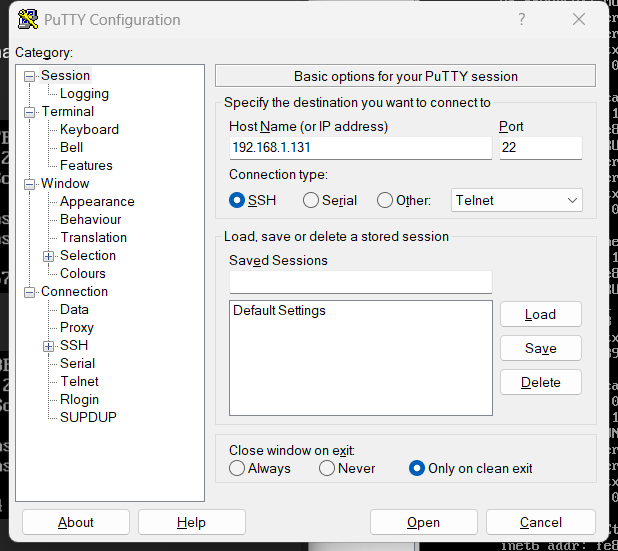

On va accepter la connexion même si la clé hôte est en clair pour le
serveur :

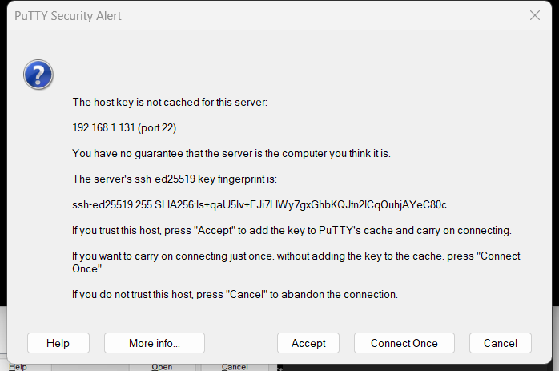

Pour se connecter, on va renseigner notre nom d'utilisateur suivi de
notre mot de passe :

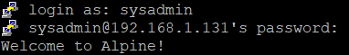

Ainsi, une connexion en SSH a bien été établie

Pour afficher de nouveau le token pour ajouter des worker sur notre
cluster on va taper la commande suivante :

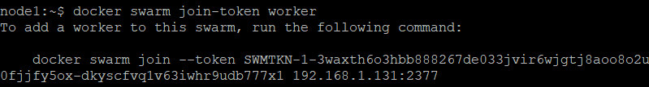

L'intérêt d'ouvrir une session SSH sur nos différentes machines va être
de pouvoir copier/coller la commande **docker swarm join** avec le token
pour rajouter rapidement et facilement nos worker

Ainsi, les worker1 et 2 ont bien rejoint le cluster :

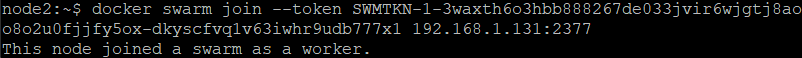

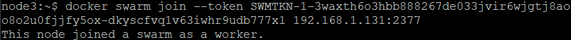

Pour être sûr que tout fonctionne correctement sur notre cluster et que
nos deux worker soient bien connectés au cluster, on va utiliser la
commande docker node ls :

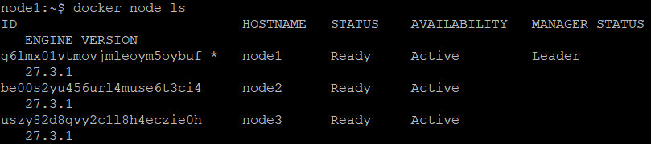

Ainsi on peut voir que nos trois machines sont bien connectées entre
elles à l'aide du cluster, le leader peut être identifié et chaque
machine est distinguable puisque on a modifié le nom de chaque machine.

## 5. Déploiement d'un Service Web Répliqué (Nginx)

Dans notre cas nous allons mettre en place le service nginx pour faire
le test

On va taper la commande suivante sur la machine manager :

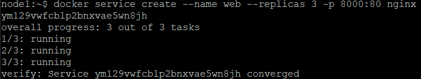

- docker service create : Crée un nouveau service dans Docker Swarm. Un
  service dans Docker Swarm est une appli qui peut être déployée sur
  plusieurs nœuds dans le cluster.

- --name web : Donne le nom du service créé. Ici, le service créé
  s'appelle web.

- --replicas 3 : Spécifie le nombre de réplicas (instances) du service
  que Docker doit exécuter. Dans ce cas, Docker va créer 3 réplicats du
  service, ce qui signifie 3 conteneurs identiques exécutant le même
  service Nginx.

- -p 8080:80 : Lie le port 8080 de la machine hôte (le nœud qui exécute
  le service) au port 80 du conteneur. Ainsi, chaque fois qu'on va
  accéder à **http://<adresse-ip-manager****>:8080**, alors on
  accèdera au service Nginx qui s'exécute sur le port 80 dans les
  conteneurs.

- **nginx** : Il s'agit de l'image Docker à utiliser pour créer les
  conteneurs du service. Dans ce cas, l'image Nginx est utilisée pour
  exécuter un serveur web Nginx dans chaque réplique du service.

On va ensuite vérifier que les services tournent :

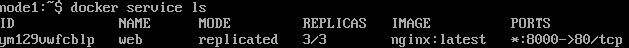

Ainsi que les conteneurs :

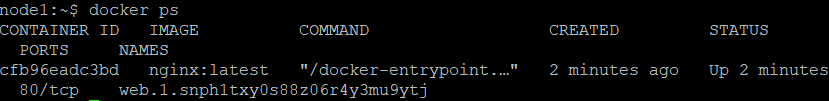

Nous allons tester le bon fonctionnement de Nginx en accédant à
l'adresse http://192.168.1.131:8000.

Ainsi lorsqu'on se connecte sur l'URL indiquée plus haut sur notre
navigateur on arrive sur la page par défaut de Nginx, le service est
donc bien installé :


Il est également possible de prouver le bon fonctionnement du service à
l'aide de la commande curl
**[http://192.168.1.129:8000](http://192.168.1.129/8000)** :

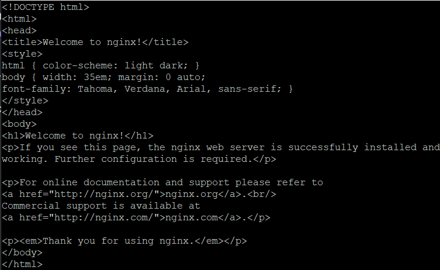

## 6. Supervision du Cluster avec Portainer

Pour finir la mise en place de notre cluster, nous allons utiliser
Portainer pour avoir une vue globale sur notre infrastructure.

Pour faire ceci, sur notre machine manageur nous allons créer un nouveau
fichier qui s'appellera docker-compose.yml et nous allons l'ouvrir à
l'aide de l'éditeur de texte nano :

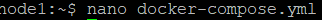

Dans ce fichier fraichement crée nous allons ajouter le contenu suivant
:

```yaml
version: '3.8'
services:
  portainer:
    image: portainer/portainer-ce:latest
    volumes:
      - /var/run/docker.sock:/var/run/docker.sock
      - portainer_data:/data
    ports:
      - 9000:9000
    deploy:
      replicas: 1
      placement:
        constraints:
          - node.role == manager
volumes:
  portainer_data:
```

**Explication du fichier :**

- version: '3.8' : Spécifie la version de Docker Compose utilisée.

- services : Définit les services qu'on souhaite déployer. Ici, ce sera
  Portainer.

- portainer : C'est le nom du service. Ici ce sera l'application
  Portainer.

- image : Spécifie l'image Docker à utiliser. Ici, on utilise l'image
  officielle de Portainer.

- volumes : Monte le socket Docker (/var/run/docker.sock) afin que
  Portainer puisse interagir avec le Docker de notre nœud. Le volume
  portainer_data est également utilisé pour stocker les données de
  Portainer.

- ports : Le port 9000 est mappé pour accéder à l'interface graphique
  de Portainer.

- deploy : Spécifie les options de déploiement dans Docker Swarm, comme
  le nombre de répliques et où le service doit être déployé (ici sur un
  nœud manager).

Il ne nous reste plus qu'à sauvegarder et à quitter le fichier

Pour finir, nous allons déployer Portainer à l'aide de la commande
suivante :

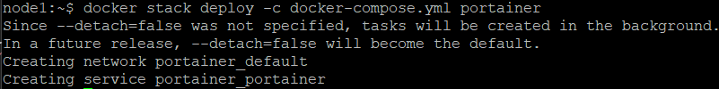

Désormais il ne nous reste plus qu'à accéder à portainer à l'aide de
l'adresse suivante : http://192.168.1.131:9000

Nous allons arriver sur la page de connexion qui va nous demander de
créer un utilisateur admin et d'y ajouter un nouveau mot de passe puis
de le confirmer :

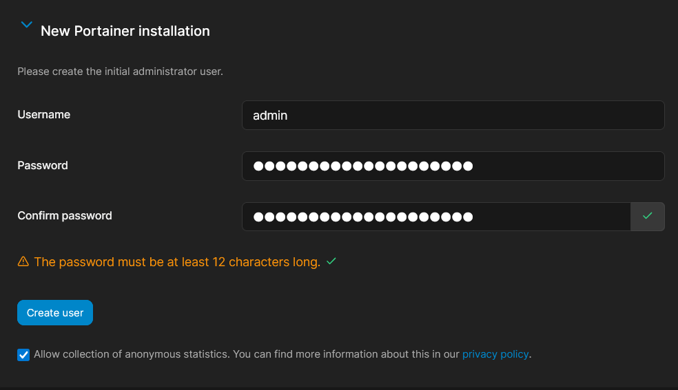

Sur portainer nous allons avoir une interface avec de nombreuses options
de personnalisation concernant les utilisateurs ou l'environnement, par
exemple :

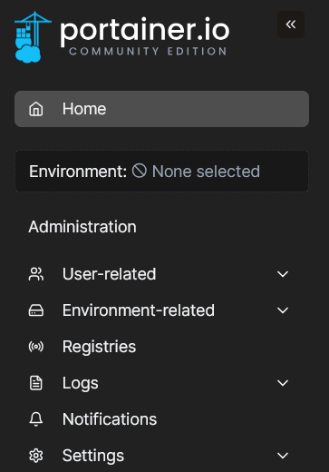

Justement, dans la partie Environnement on peut voir que notre cluster
est bien détecté :

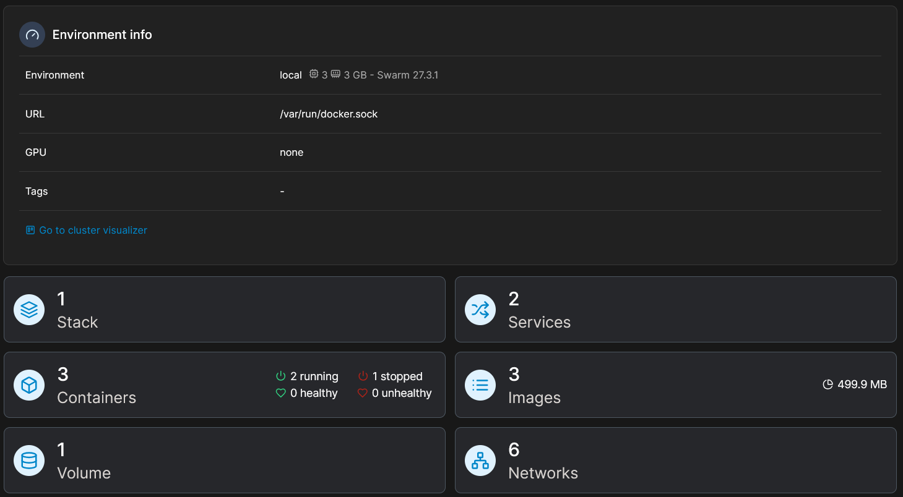

On peut y retrouver nos conteneurs :

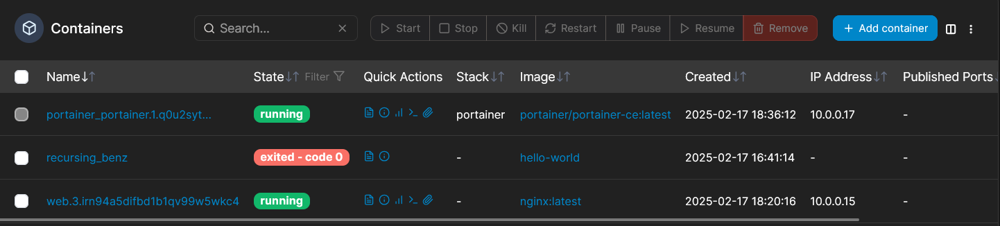

Nos stacks :

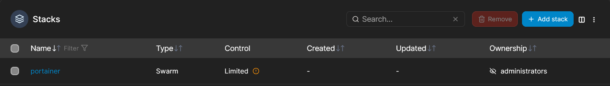

Nos services :

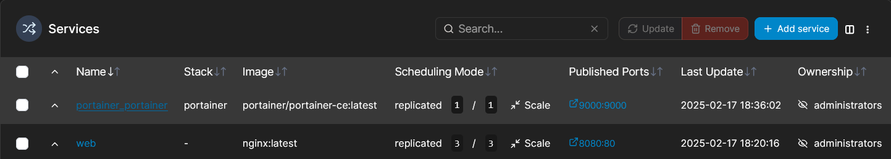

Nos images :

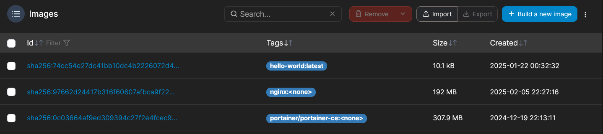

Nos volumes :

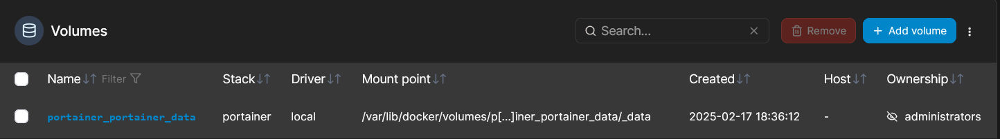

Et nos réseaux :

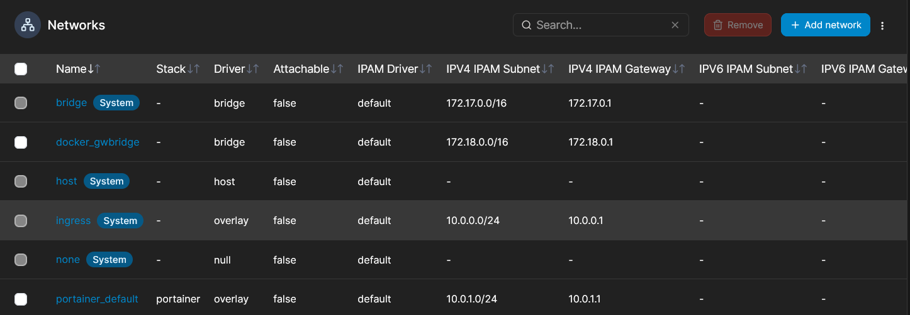

Pour finir dans la partie Swarm on peut voir nos différents nœuds
présent dans le cluster :

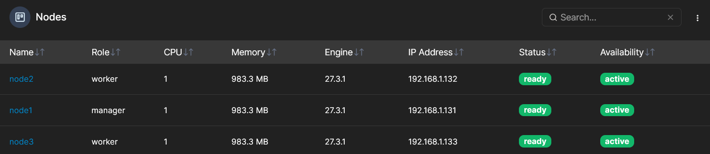

Pour finir voici une représentation graphique de notre cluster :

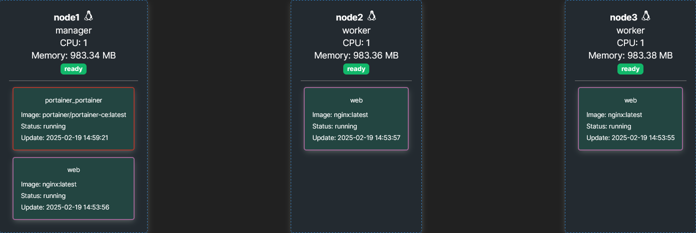

## 7. Hardening & Sécurisation Avancée du Cluster

Plusieurs améliorations peuvent être mis en place sur notre cluster
notamment au niveau de la sécurité

### 7.1 Chiffrement des communications entre nœuds :

Pour faire ceci on va taper la commande suivante :

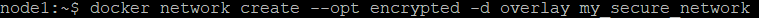

Cette commande va permettre de créer un nouveau réseau docker de type
overlay avec un chiffrement de communication entre les différents nœuds
du cluster Swarm.

Désormais pour vérifier si le chiffrement des communications est bien
actif nous allons utiliser l'outil tcpdump

Après avoir installé l'outil sur nos worker nous allons taper la
commande suivante :

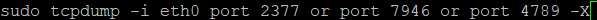

Explication des ports :

- 2377 -> Port utilisé par Swarm pour le contrôle du cluster.

- 7946 -> Port utilisé pour la découverte des nœuds et la communication
  entre eux.

- 4789 -> Port utilisé pour le trafic overlay des services Docker
  Swarm.

Cette commande va permettre d'écouter les paquets en transit sur le
réseau Swarm

Voici ce que nous allons obtenir à l'aide de la commande :

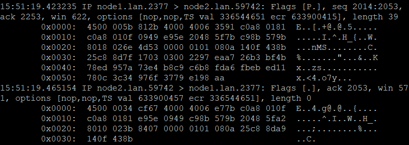

Comme nous pouvons le constater, les valeurs affichées sont en
hexadécimal et illisibles, ce qui prouve que le chiffrement est bien
actif.

Normalement, sans chiffrement, nous devrions voir des requêtes HTTP en
clair. Ici, le chiffrement fonctionne correctement.

### 7.2 Activation de l'auto-lock sur Swarm :

L'auto-lock va obliger l'administrateur à déverrouiller manuellement les
nœuds manager après un redémarrage

Pourquoi mettre en place ce dispositif de sécurité ? :

- Par défaut, Swarm stocke ses clés de chiffrement dans la Mémoire vive
  du manager.

- Si le manager redémarre, les clés sont automatiquement rechargées, ce
  qui peut être un risque de sécurité.

- Avec --autolock=true, Swarm exige une intervention manuelle pour
  déverrouiller le cluster après un redémarrage.

Pour mettre en place l'option auto-lock on va taper la commande suivante
:

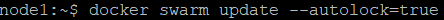

Voici ce que la commande va retourner :

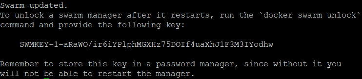

Ainsi la clé de déverrouillage nous est affichée il faudra donc bien la
conserver pour le prochain redémarrage

De la même manière si on tape la commande suivante :

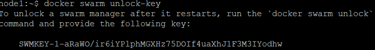

On obtient également la clé de déverrouillage

Pour tester notre nouvelle mesure de sécurité on va redémarrer notre
machine manager en prenant bien soin de conserver notre clé de
déverrouillage

Lorsque je vais taper la commande docker swarm unlock-key pour afficher
ma clé de déverrouillage je vais obtenir le message suivant :


Pour débloquer ma machine manager je vais taper la commande suivante :


Puis ici je vais rentrer ma clé :


Ainsi, mon nœud manager est bien déverrouillé.

### 7.3 Vérification des logs de Docker pour détecter des anomalies : 

Sur Alpine Linux, nous allons utiliser docker logs ou lire
/var/log/docker.log pour lire nos fichiers de logs et voir les erreurs
éventuelles.

Par exemple nous allons lire les logs de notre service Nginx :

Pour cela nous allons vérifier nos conteneurs en cours de démarrage à
l'aide de la commande docker ps :


Pour donner suite à cela nous allons taper la commande docker logs suivi
de l'ID de notre conteneur :


Voici ce que nous obtenons comme résultat :


Nous n'avons pas d'erreur ou de possible intrusion dans les logs de
notre service Nginx

## 8. Bilan & Synthèse Technique

Ainsi nous avons pu mettre en place un cluster avec l'outil
d'orchestration Swarm à l'aide de trois machines alpines.

Sur ces trois machines nous avons installé docker puis nous l'avons
testé en utilisant l'image hello-world

Nous avons ensuite initialisé Swarm sur la machine manager, ce qui a
généré une commande permettant aux machines worker de rejoindre le
cluster.

Une fois le cluster mis en place et les trois machines connectées, nous
avons installé le service Nginx pour illustrer le déploiement d'une
application sur Swarm.

Enfin, nous avons ajouté Portainer pour superviser plus facilement notre
cluster.
