# Rapport d'Audit de Sécurisation d'un Service Linux Vulnérable

## 1. Introduction

*Le présent rapport décrit l'audit de sécurité effectué sur une machine
virtuelle exécutant un service Linux vulnérable. L'objectif de cet audit
est d'identifier les vulnérabilités d'un service mal configuré,
d'exploiter cette faille pour obtenir un accès non autorisé, puis
d'analyser l'activité et les journaux pour comprendre l'intrusion.
Enfin, des mesures de sécurisation sont mises en place pour limiter les
risques futurs.*

## Mise en place de l'environnement

### 2.1 Machines virtuelles

- Une machine virtuelle a été configurée comme **machine cible**. Cette
  machine tourne sur un système metasploitable2 qui contient déjà
  beaucoup d'anciennes versions de logiciels qui contiennent des
  vulnérabilités simples à exploiter.

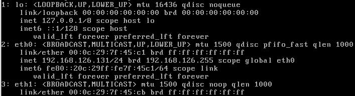

- Une seconde machine a été utilisée comme **machine attaquante**.
  Cette machine tourne sur un système Kali Linux.

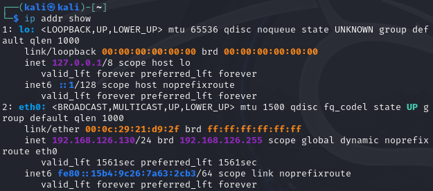

### 2.2 Service vulnérable installé

- Sur la **machine cible**, un service vulnérable a été installé, un
  ancien serveur FTP (vsftpd 2.3.4), qui est connu pour sa
  vulnérabilité.

Pour montrer que ce service est bien installé on va réaliser dans un
premier temps un ping sur la machine cible pour bien vérifier que nos
deux machines sont en communication :

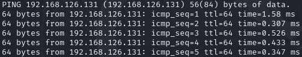

On obtient bien une réponse de la part de la **machine cible** on peut
donc en conclure qu'il y a bien communication entre les deux machines

Pour débuter notre attaque et montrer la présence d'un ancien serveur
FTP (vsftpd 2.3.4) nous allons réaliser une commande **nmap --sV
<adresse_IP_de_la_machine_cible>

Voilà ce que nous allons obtenir après le scan à l'aide de l'outil nmap
qui nous permet d'analyser le trafic réseau et de voir les différents
ports ouverts à l'aide de l'option sV :


Plus précisément nous voyons bien que l'ancien serveur ftp est bien
présent :


- *Cette version est connue car les développeurs avaient installé une
  backdoor pour des fonctions de maintenance et de réparation,
  malheureusement il est alors très facile d'exploiter cette faille pour
  réaliser une élévation de permissions et prendre le contrôle du
  système.*

### 2.3 Vérification de l'accessibilité

- Le service était accessible via le réseau entre les deux machines
  (testé en utilisant nmap).

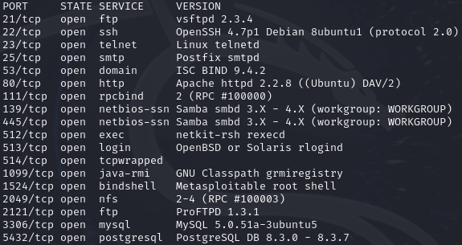

La communication est bien fonctionnelle entre les deux machines car le
scan fonctionne et nous rapporte les ports ouverts ainsi que des détails
sur les logiciels et leurs versions qui exploitent ces ports

- Ping pour vérifier la bonne communication entre les deux machines


Même chose ici les pings sont bien fonctionnels à partir de l'adresse IP
de notre machine cible, aucune erreur n'est à déployer et le temps en
millisecondes de chaque ping est très rapide, rien ne pose donc un
souci.

### 2.4 Méthode d'attaque

- Utilisation du logiciel Metasploit déjà installé nativement sur la
  machine Kali Linux, cela va permettre de rechercher une vulnérabilité
  exploitable sur un logiciel déjà installé et allumé sur un port
  ouvert, puis de l'exploiter pour réaliser diverses actions sur la
  machine cible, dans notre cas nous cherchons à obtenir une élévation
  de privilèges pour prendre le contrôle de la machine vulnérable.

Comme nous pouvons le voir, le logiciel est déjà présent nativement sur
la machine Kali :


Il est également possible de le lancer à l'aide de la commande suivante
:

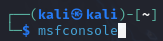

Voici à quoi ressemble l'interface de l'outil metasploit :

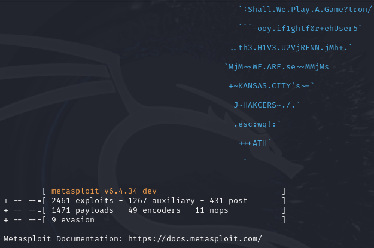

## 3. Scan et collecte d'informations

### 3.1 Scan avec nmap

- Sur la machine attaquante, un scan Nmap a été effectué pour
  identifier les ports ouverts et les services exposés sur la machine
  cible.

- Commande nmap utilisée pour effectuer un scan du trafic réseau, pour
  trouver les ports ouverts et obtenir des détails sur les logiciels qui
  utilisent ces ports :

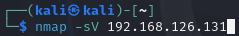

- Les résultats ont révélé que le port 21 (FTP) était ouvert et
  exécutait une version vulnérable de vsftpd :

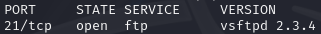

### 3.2 Vulnérabilités identifiées

Comme nous avons pu voir lors du scan de nmap, la machine cible possède
le service vsftpd 2.3.4. Si nous allons voir rapidement sur le net nous
pouvons voir qu'un rapport de CVE (Common Vulnerabilities Exposure) a
déjà été déposé sur cette version de vsftpd :

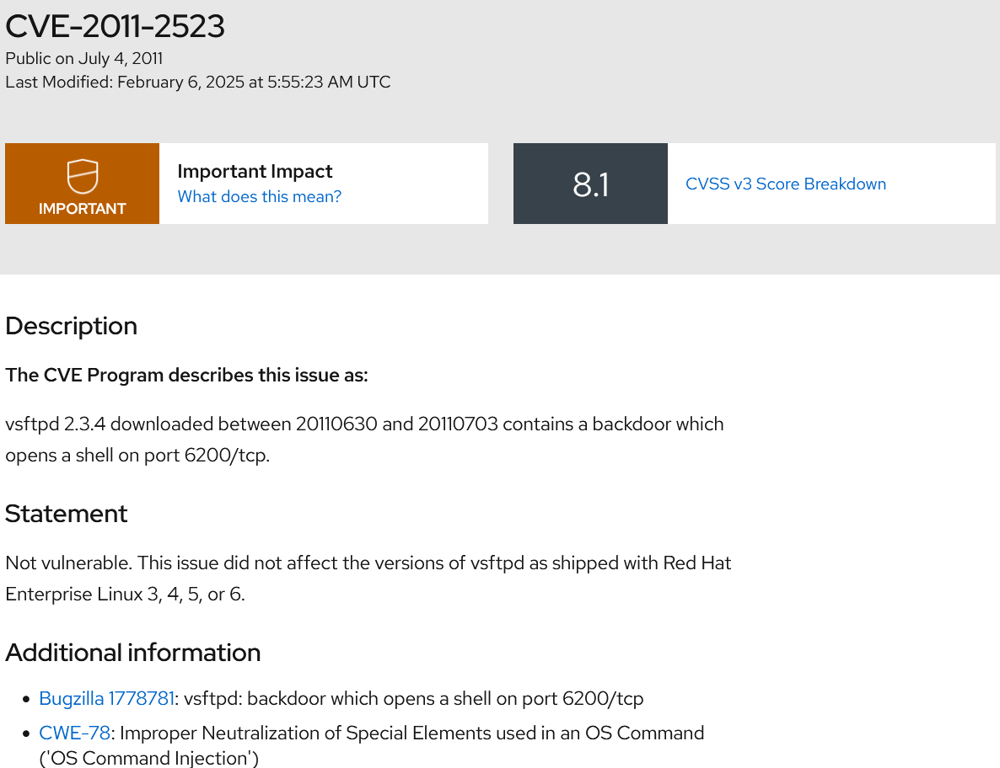

Nous pouvons voir que cette version contient une backdoor qui ouvre un
terminal shell sur le port 6200/tcp

Cette vulnérabilité a obtenu un score de 8.1 en CVSS ce qui signifie que
cette faille peut provoquer des gros dégâts et qu'elle est très simple à
exploiter

Pour en parler rapidement, les CVSS (Common Vulnerabilities Scoring
Systems) sont les scores attribués à une vulnérabilité, la note finale
va de 1 à 10 avec 10 étant une vulnérabilité extrêmement problématique
pour la cible (prise de contrôle de l'appareil, altération de fichiers
importants, vol de données) et étant également très simple à exploiter
pour un attaquant (par exemple une backdoor présente sur un logiciel)

Ce système de score permet de connaître la dangerosité d'une
vulnérabilité pour s'en prémunir le plus efficacement et rapidement
possible, bien sûr, on ne va pas réagir aussi rapidement entre une CVE
qui possède un score de 8 face à une vulnérabilité qui possède un score
de 1,5 (donc qui va produire peu de dégâts et qui est vraiment compliqué
à exploiter)

Dans notre cas précis cette vulnérabilité est parfaite car c'est ce que
nous cherchons pour prendre le contrôle de la machine cible. Nous allons
donc passer à la phase d'attaque sur la machine cible

Lien vers la CVE concernée :
<https://access.redhat.com/security/cve/cve-2011-2523>

### 3.3 Scan spécifique au service

**Utilisation de la commande Nikto** pour scanner le service web et
vérifier les vulnérabilités potentielles dans ce service **:**

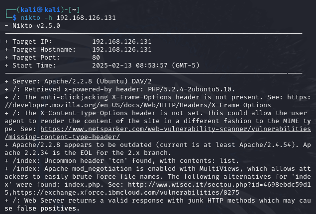

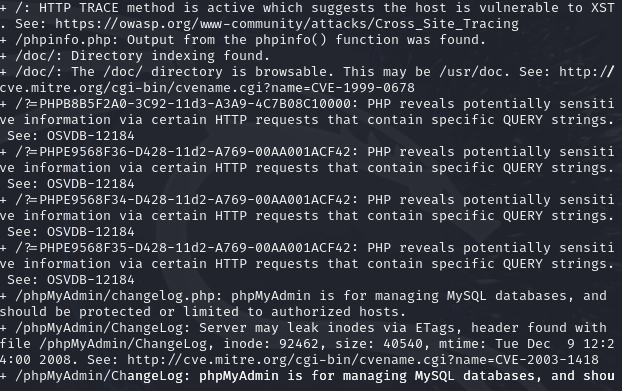

Ce scan est plus spécifique pour des services utilisant les services web
comme Apache ou Nginx mais cela était pour trouver potentiellement
d'autres failles à réaliser

## 4. Exploitation de la vulnérabilité

### 4.1 Démarche d'exploitation
maintenant que nous connaissons le logiciel exploité (vsftpd 2.3.4) nous pouvons démarrer notre attaque

On démarre Metasploit :

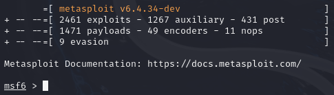

Nous allons ensuite taper la commande search qui permet de rechercher
une vulnérabilité suivie du nom du service que nous souhaitons exploiter
:

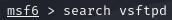

On obtient deux failles concernant deux versions différentes de vsftpd :

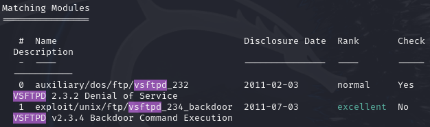

Nous pouvons voir que deux failles sont disponibles, la première qui
permet de réaliser un DDOS ou une interruption de service sur la version
2.3.2, malheureusement, nous ne possédons pas cette version de vsftpd et
le rang de la vulnérabilité est normal ce qui signifie qu'elle n'est pas
si facile que cela à exploiter pour des résultats moins intéressants

Heureusement la seconde vulnérabilité concerne notre version installée
et son rang est excellent, nous allons donc vérifier les informations de
cette vulnérabilité :


Voici les informations que nous obtenons :

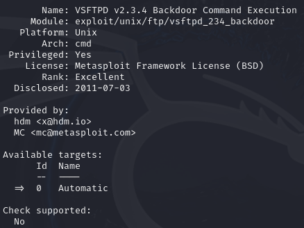

Comme nous avons pu voir précédemment cette faille utilise une backdoor,
elle est exploitable sur les plateformes Unix ce qui est une excellente
nouvelle pour nous car il est possible d'avoir des CVE qui ne sont pas
compatibles avec notre OS.

Pour exploiter cette faille nous pouvons également voir que nous devons
renseigner l'adresse IP de la cible ainsi que le numéro de port exploité
:

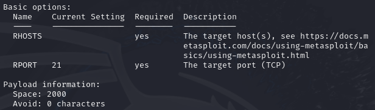

Maintenant que nous avons ces informations il est temps d'attaquer

### 4.2 Accès non autorisé

Pour débuter l'attaque, nous allons utiliser la commande use suivi du
chemin de la vulnérabilité que nous avons trouvé plus tôt :

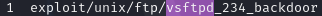

Voici ce que cela va donner en commande :

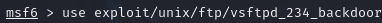

Désormais il ne nous reste plus qu'à renseigner l'adresse IP de l'hôte
et le ping exploité

Renseignement de l'adresse IP de l'hôte ou de la cible :

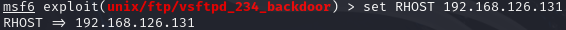

Puis renseigment du port exploité :

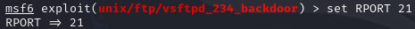

Il n'y a plus qu'à lancer la commande exploit pour lancer un terminal
sur la machine cible avec une élévation de privilège :

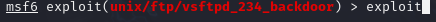

Nous allons obtenir le résultat suivant :

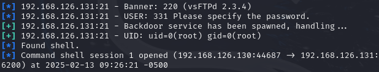

On peut voir que nous avons bien pu démarrer un terminal en tant que
l'utilisateur root

Désormais nous allons tester ce que nous pouvons faire avec nos nouveaux
privilèges

Si je fais la commande **ls** je peux voir tous les répertoires présents
sur la machine :

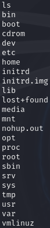

Si je fais un pwd du côté de la machine cible je peux voir que je me
trouve dans le répertoire suivant :

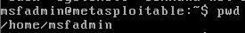

Du côté de ma machine attaquante, je vais donc créer un nouveau fichier
dans ce répertoire pour voir si la modification est bien présente sur la
machine cible

Je me rends donc dans le répertoire utilisé par l'admin sur la machine
cible puis je crée un fichier qui s'appelle HACKED :

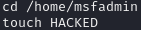

Et si je regarde du côté de ma machine cible le fichier est donc bien
présent :

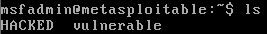

Je peux également utiliser la commande "whoami" pour prouver que je suis
bien connecté en tant qu'utilisateur super-user ou root

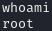

Ainsi j'ai bien pu me connecter en tant que root à la machine cible et
créer un fichier du nom de HACKED, désormais je vais me déconnecter et
nous allons passer à l'analyse post-exploitation, pour vérifier les
différentes traces liées à l'attaque.

## 5. Analyse post-exploitation

### 5.1 Examen des logs :

- Identifier les fichiers de log à analyser (/var/log/syslog,
  /var/log/auth.log, /var/log/secure, etc.).

En inspectant le fichier /var/log/syslog nous pouvons voir que l'adresse
IP 192.168.126.130 s'est connectée à notre machine sans notre
autorisation à l'aide du logiciel metasploit vers 8h41 (la bonne heure
n'est pas renseignée sur notre machine metasploit) :

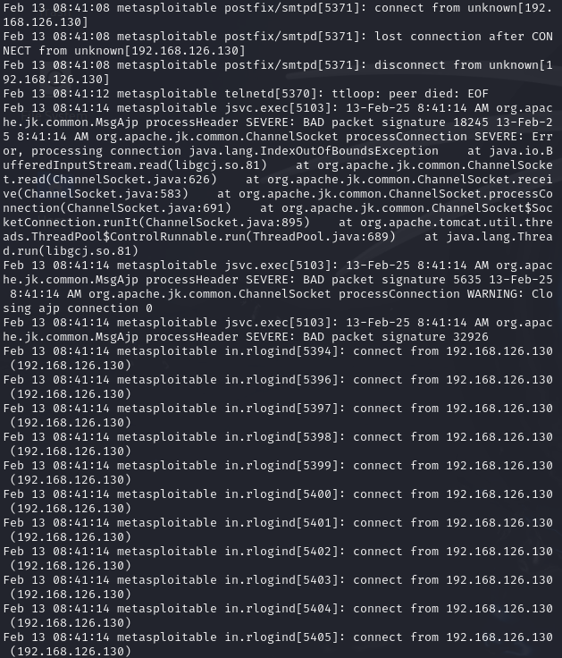

Cette image est également intéressante car on peut voir que Metasploit
surveille les adresses réseau de notre machine cible :

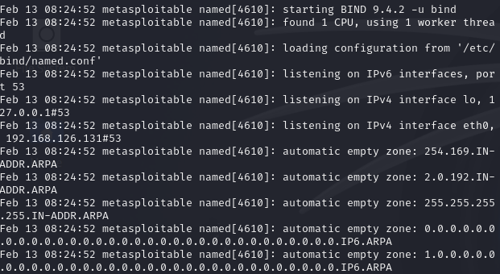

On obtient de plus amples détails en inspectant le fichier
/var/log/auth.log :

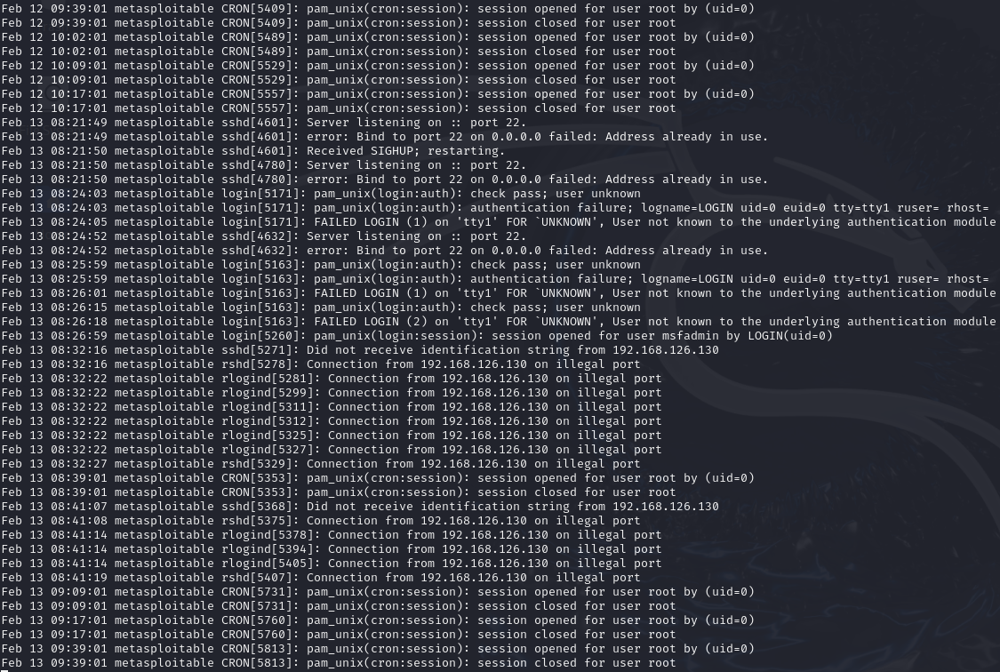

L'adresse IP 192.168.126.130 s'est connectée en tant que root au port
22 à l'aide du logiciel metasploit, il y a eu une erreur de login car
cet utilisateur n'est pas reconnu par le système et donc ne devrait pas
normalement avoir un droit de connexion sur tout en tant que root, ainsi
nous arrivons à outrepasser le service d'authentification pam et nous
obtenons un accès complet au système

Nous pouvons également voir que le message suivant s'est affiché,
signifiant que nous étions en train de surveiller les ports ouverts :

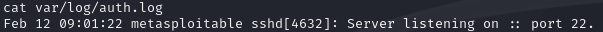

### 5.2 Chronologie de l'attaque
Reconstitution des étapes de l'attaque en fonction des informations des
logs.

Pour reconstituer la chronologie on peut voir que dans un premier temps
Metasploit a analysé le port 22 qui est le port relatif au protocole SSH
pour donner suite à l'utilisation de notre commande nmap --sV. Ensuite
il a analysé les interfaces et les adresses IPv4 et IPv6.

Ensuite il a tenté de se connecter en root à l'aide de la commande
exploit et des différents paramètres que nous lui avons passés,
normalement nous n'aurions pas pu nous connecter car le système cible
était équipé d'un système PAM qui nécessite d'être utilisateur pour
pouvoir accéder aux systèmes mais à l'aide de la backdoor nous pouvons
contourner le système PAM et donc nous connecter en tant que ROOT à la
machine cible.

## 6. Mesures de sécurisation

### 6.1 Mise à jour du service vulnérable
Applicage des correctifs ou mise à jour pour résoudre la vulnérabilité
(changer la version du serveur FTP, configurer correctement le service).

Voici ce que nous avons comme port ouvert exploité par des services avec
leur version visible en clair :

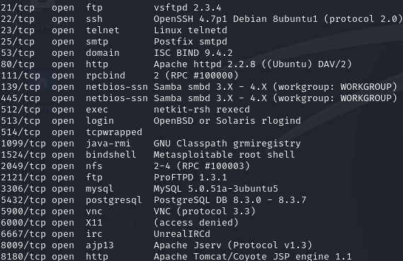

Dans un premier temps nous allons faire une mise à jour complète des
différents logiciels pour ne plus avoir de vulnérabilité de ce côté,
nous rajouterons d'autres mesures de sécurité ensuite

Nous allons donc vérifier s'il y a des MAJ disponibles

```bash
sudo apt update && sudo apt upgrade -y
```

Cela va permettre de mettre à jour nos versions de logiciels et
patcher certaines des vulnérabilités

Nous obtenons les mêmes résultats dans sV. Nous allons faire en sorte de
ne plus pouvoir voir les logiciels pour une personne extérieure :

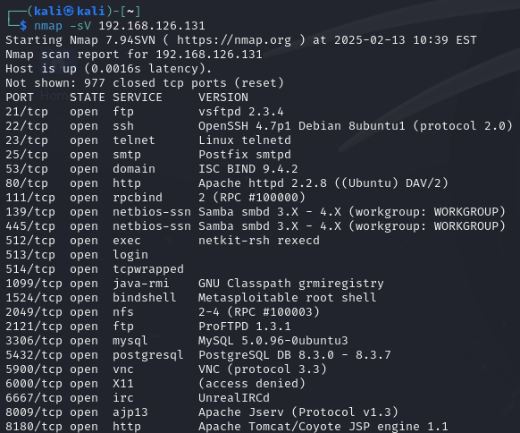

#### 6.1.1 Mesure de protection de Apache2 

Pour protéger Apache nous allons ajouter la ligne server tokens et
serversignature pour ne plus afficher de détails sur le logiciel utilisé
:

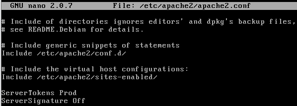

#### 6.1.2 Masquage de la version du serveur

On rajoute dans le fichier /etc/ssh/sshd_config la commande
"VersionAddendum none" pour ne plus afficher la version du serveur :

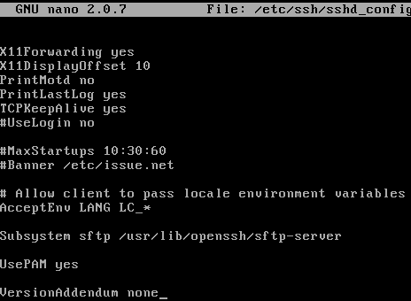

#### 6.1.3 : Fermeture manuellement des services ftp :

On va ensuite fermer manuellement les services FTP à l'aide de la
commande sudo kill suivi de l'id du service :

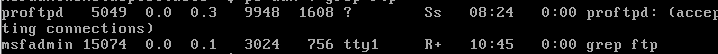

Ici 5049 et 15074

### 6.2 Configuration d'un pare-feu
Utilisation de iptables ou ufw pour restreindre l'accès au service vulnérable.

#### 6.2.1 : Les règles prédéfinies

On va ensuite mettre en place un pare-feu, dans un premier temps je vais
vérifier les règles de sécurité mises en place :

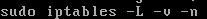

Voici les règles prédéfinies :

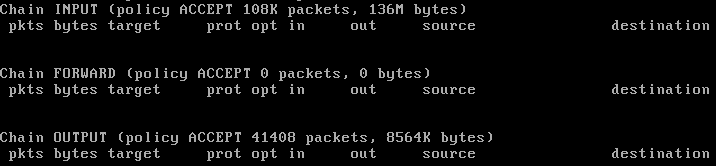

#### 6.2.2 : Ajouts de nouvelles règles

Nous allons désormais ajouter plusieurs règles pour filtrer le trafic
entrant et sortant :

La commande suivante :

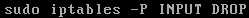

Va permettre de bloquer tout le trafic entrant

La commande suivante :

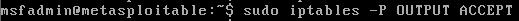

Va permettre d'autoriser tout le trafic sortant

La commande suivante :

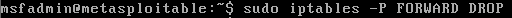


Va permettre de bloquer tout le trafic de transfert

#### 6.2.3 : Autorisation des connexions établies et des connexions liées

On va ensuite autoriser les connexions établies et les connexions liées,
Pour permettre aux connexions déjà établies de continuer à fonctionner
(par exemple, une session SSH active)

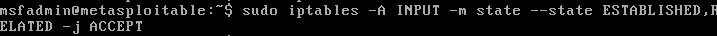

### 6.2.4 : Autorisation des connexions en SSH

On va ensuite ajouter la règle suivante pour permettre les connexions
SSH :


#### 6.2.5 : Test du pare-feu

Désormais si on fait un scan à l'aide de nmap via la machine Kali voyons
ce que nous obtenons :

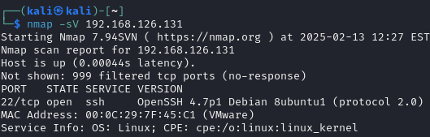

Pour donner suite aux différentes règles que nous avons appliquées nous
pouvons voir que seul un service est encore visible openSSH

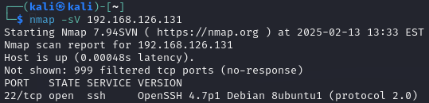

Pour que l'attaquant ne puisse plus voir le service OpenSSH via nmap
nous allons rajouter la règle suivante qui va empêcher toute connexion
entrante sur le port 22 et donc Nmap ne pourra pas le détecter :

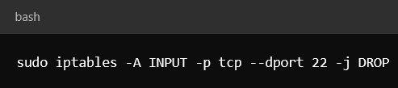

### 6.3 : Verrouillage de l'accès à la machine
attaquante : Vérifier que l'attaquant n'a plus accès au service et à
la machine.

Nous allons ensuite verrouiller l'attaquant pour être sûr qu'il ne
pourra plus avoir accès à notre machine même en utilisant une faille de
sécurité

#### 6.3.1 : Identification de l'attaquant

Pour débuter nous allons nous rendre dans le fichier /var/log/vsftpd.log
à l'aide de la commande suivante :


Voici ce que le fichier nous retourne

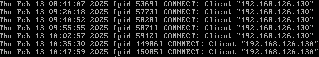

Nous pouvons donc voir que l'adresse IP de la machine attaquante est
192.168.126.130

Il est donc temps de bloquer cette adresse IP pour éviter toute future
attaque

#### 6.3.2 : Blocage sur le pare-feu de l'adresse IP de l'attaquant

Nous allons ajouter la règle suivante dans notre pare-feu :

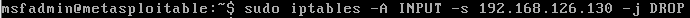

Ainsi cette IP est bloquée, elle ne pourra plus se connecter à notre
machine même à l'aide d'une backdoor ou d'une autre vulnérabilité en
théorie

Pour finir nous allons mettre fin aux potentielles sessions de
l'attaquant encore ouvertes pour lui réfuter tout accès à notre machine

#### 6.3.3 : Vérification des sessions ouvertes sur la machine

On va utiliser la commande suivante pour voir les processus actifs
utilisés en SSH :

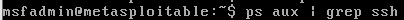

Voici ce que nous retourne la commande :

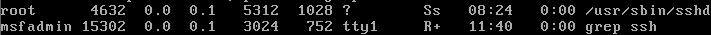

Deux utilisateurs sont connectés en SSH, le premier qui est msfadmin qui
est la session par défaut pour pouvoir se connecter à la machine mais il
y a également un second utilisateur qui est connecté en root, cela doit
être la session de l'attaquant qui n'a pas été éteinte, nous allons nous
empresser de le faire

On va utiliser la commande suivante :

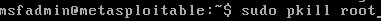

Pour pouvoir tuer la connexion SSH en root donc celle utilisée par
l'attaquant

#### 6.3.4: Vérification et fermeture des connexions IP de l'attaquant 

En utilisant la commande suivante :


Nous pouvons voir toutes les connexions IP de la machine attaquante sur
notre machine

Pour toutes les fermer, nous allons utiliser la commande suivante :


Désormais pour renforcer la sécurité nous allons modifier certaines
parties de notre machine

#### 6.3.5 : Désactivation de l'accès root à l'aide de SSH

Dans un premier temps, nous allons désactiver l'accès au compte root à
l'aide du protocole SSH

Nous allons nous rendre dans le fichier /etc/ssh/sshd_config, puis on va
changer la ligne PermitRootLoginin de yes en no :


Devient


#### 6.3.6 : Installation et configuration de l'outil fail2ban 

Nous allons activer le bannissement des IP suspectes à l'aide de l'outil
fail2ban, dans un premier temps nous allons l'installer :


Nous allons ensuite taper la commande suivante pour copier le fichier de
configuration par défaut


Une fois dans le fichier, nous allons nous rendre dans la partie SSH
pour modifier les lignes suivantes

Cette partie


Devient :


Ainsi on indique bien le bon port (port 22), le maxretry bannis l'IP au
bout de 3 mauvais mot de passe ce qui réduit le risque d'intrusion d'un
personnel non autorisé et on ajoute un bantime de 600 secondes qui
bloque les IP pendant ce temps ce qui évite de nouvelles tentatives de
connexion d'individu criminel

Lorsqu'on tape la commande who on peut voir que deux users sont
connectés sur la machine, l'user de base sur le terminal et un root qui
est connecté à distance donc potentiellement via SSH ou FTP par exemple
:


Pts/0 signifie que la connexion est à distance, et non localement sur la
machine

Pour pallier cela, nous allons utiliser la commande suivante :


Pour tuer toutes les sessions SSH ouvertes par root

### 6.4 Validation des mesures : Vérifier l'efficacité des mesures mises en place.

Nous allons désormais essayer de nous connecter avec la même faille pour
voir si c'est encore possible ou si le système de défense que nous avons
mis en place va nous bloquer


Comme nous pouvons voir, il nous est désormais impossible de nous
connecter via le service vsftpd, ni par l'hôte en lui-même d'ailleurs
puisque nous avons interdit toutes les connexions distantes et nous
avons également bloqué l'adresse IP de la machine attaquante

## 7 : Conclusion

Ainsi notre machine metasploit est enfin protégée de notre machine kali,
bien sûr toutes les différentes failles n'ont pas été patchées puisque
les machines metasploit sont conçues pour contenir énormément de failles
pour pouvoir réaliser facilement des tests d'intrusion

*L'attaquant est désormais bloqué grâce aux mesures suivantes :*

1.  Bannissement de son adresse IP via le pare-feu.

2.  Filtrage des connexions avec un pare-feu (iptables).

3.  Désactivation des accès non autorisés (interdiction de connexion
    root en SSH).

4.  Installation et configuration de Fail2Ban pour bloquer les
    tentatives de connexions répétées.

5.  Scan avec Nmap inefficace : le service FTP est inaccessible et
    Metasploit ne peut plus exploiter la faille.

## 8 : Politique de Sécurité des Systèmes d'Information (PSSI) -- Serveur Linux

### 8.1. Objectif et champ d'application

!!! info "Objectif et champ d'application"
    Cette PSSI définit les règles de sécurité applicables à un serveur
    Linux afin de garantir la protection des données, la disponibilité des
    services et la prévention des cyberattaques. Elle s'applique à
    l'ensemble des utilisateurs, administrateurs et services ayant accès
    au système.

### 8.2. Principes généraux

1.  **Confidentialité** : Protéger les accès aux informations sensibles.

2.  **Intégrité** : Garantir que les fichiers et configurations ne
    soient pas altérés.

3.  **Disponibilité** : Maintenir les services critiques en
    fonctionnement sécurisé.

### 8.3. Gestion des accès et authentification

!!! danger "Obligations"
    1. **Accès restreint** : L'accès au serveur est strictement réservé aux utilisateurs autorisés.
    2. **Mots de passe** : Authentification par mot de passe fort obligatoire (12+ caractères, majuscules, minuscules, chiffres, caractères spéciaux).
    3. **SSH Root** : L'accès `root` direct en SSH est strictement interdit (`PermitRootLogin no` dans `/etc/ssh/sshd_config`).
    4. **Élévation** : Connexion via compte à privilèges limités puis élévation via `sudo`.
    5. **Clés SSH** : Authentification par clés requise (`PasswordAuthentication no`).

!!! example "Recommandations"
    * **2FA** : Authentification à deux facteurs conseillée pour SSH.
    * **IP Whitelisting** : Limiter les accès SSH aux IP autorisées via `/etc/hosts.allow`.
    * **Port SSH** : Modifier le port par défaut (ex: `2222` au lieu de `22`).

### 8.4. Sécurisation des services et du réseau

!!! danger "Obligations"
    1. **Minimisation des services** : Seuls les services nécessaires doivent être installés et activés.
    2. **Fermeture des ports** : Les ports inutilisés doivent être fermés (`netstat -tulnp` pour identifier les services actifs).
    3. **Pare-feu** : Un pare-feu (`iptables` ou `ufw`) doit être configuré pour bloquer tout trafic non autorisé.
    4. **Fail2Ban** : Doit être installé et activé pour bloquer les tentatives répétées d'accès.
    5. **Masquage de version** : Masquer la version des services pour éviter la fuite d'informations (`ServerTokens Prod` et `ServerSignature Off` pour Apache).

!!! example "Recommandations"
    * **Segmentation** : Activer la isolation des services critiques via VLANs.
    * **Limitation des connexions** : Limiter le nombre de connexions simultanées par IP (`MaxStartups` pour SSH).

### 8.5 Gestion des mises à jour et des correctifs de sécurité

!!! danger "Obligations"
    1. **Mises à jour régulières** : Le serveur doit être maintenu à jour fréquemment via les dépôts officiels.
    2. **Automatisation** : Un script automatique ou une tâche cron doit être configuré pour appliquer les correctifs critiques.
    3. **Nettoyage des paquets** : Désinstaller tout service obsolète ou non utilisé (`apt remove <service>`).

!!! example "Recommandations"
    1. **Automatisation avancée** : Vérifier la disponibilité des mises à jour de sécurité avec unattended-upgrades.
    2. **Notifications** : Configurer une alerte automatique pour être notifié lorsqu'une mise à jour critique est disponible.

### 8.6 Surveillance et détection des incidents

!!! danger "Obligations"
    1. **Journalisation** : Tous les accès et activités doivent être enregistrés dans `/var/log/auth.log`, `/var/log/syslog` et `/var/log/fail2ban.log`.
    2. **Supervision** : Une solution d'analyse de logs et d'alerte (Logwatch, OSSEC, Fail2Ban avec notification courriel) doit être active.
    3. **Audit régulier** : L'administrateur doit contrôler périodiquement les journaux à la recherche d'anomalies ou de tentatives d'intrusion.


!!! example "Recommandations"
    * **Détection d'intrusion (IDS)** : Installer une solution réseau/hôte comme Suricata ou Snort.
    * **Alertes temps réel** : Configurer une alerte immédiate en cas de connexion du compte `root` ou de modification des fichiers sensibles.

### 8.7 : Sauvegarde et plan de reprise après incident

!!! danger "Obligations"
    1. **Sauvegardes automatiques** : Une sauvegarde automatique des fichiers critiques doit être effectuée quotidiennement avec `rsync` vers un serveur distant sécurisé.
    2. **Isolation des copies** : Des copies hors ligne (air-gapped) doivent être conservées pour prévenir la perte de données en cas d'attaque (ex : ransomware).
    3. **Procédure de restauration** : Une procédure de restauration des données doit être testée et documentée.

!!! example "Recommandations"
    * **Chiffrement** : Utiliser un serveur de sauvegarde chiffré pour protéger les données au repos et en transit.
    * **Synchronisation Cloud** : Activer une synchronisation automatique avec une solution cloud sécurisée.

### 8.8 Plan de réponse aux incidents

!!! danger "Obligations"
    En cas de détection d'intrusion, l'administrateur doit immédiatement exécuter les actions suivantes :
    
    1. **Identification** : Relever l'adresse IP de l'attaquant (`last -i`).
    2. **Isolement** : Bloquer l'IP avec le pare-feu.
    3. **Expulsion** : Fermer toutes les sessions suspectes (`who` puis `pkill -u <user>`).
    4. **Contrôle d'intégrité** : Vérifier l'intégrité des fichiers système (`debsums`, `chkrootkit`).
    5. **Remédiation** : Analyser les journaux et corriger la faille exploitée.


!!! example "Recommandations"
    * **Plan de communication** : Définir une procédure d'escalade pour signaler l'incident aux responsables et documenter les actions correctives.
    * **Exercices pratiques** : Tester régulièrement la capacité de réponse aux incidents via des simulations d'attaque.

---

Ce rapport démontre l'importance de la mise en place de mesures de sécurité adaptées pour réduire les risques d'attaques. L'application des bonnes pratiques définies dans la PSSI garantit un environnement plus sûr et résilient.
