# Audit et Sécurisation d'une infrastructure Windows Server (AD + GPO)

!!! info "Contexte du projet (Méthode STAR)"
    * **Situation** : Déploiement d'un domaine Active Directory d'entreprise sur Windows Server 2022 nécessitant une mise en conformité avec les bonnes pratiques de sécurité.
    * **Tâche** : Configurer les services de base (AD DS, DNS), joindre les postes clients, et appliquer un durcissement (Hardening) complet des accès, des identités et du réseau.
    * **Action** : Restructuration des OU, mise en place de GPO (Firewall, AppLocker, Audit), suppression des privilèges excessifs via RBAC, migration vers un compte de service gMSA et création d'une PSO pour les comptes admins.
    * **Résultat** : Un annuaire sécurisé, auditable, conforme au principe du moindre privilège et protégé contre les attaques d'élévation de privilèges courantes.


Installation de nos deux machines pour le TP :

Machine cliente :

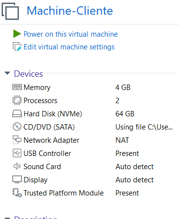

Machine-serveur :

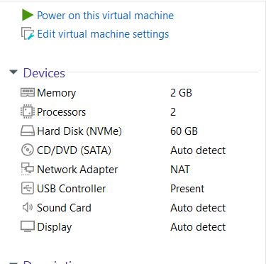

La machine-cliente tourne sous Windows 10, tandis que la machine serveur
tourne sous Windows Server 2022

## 1. Configuration de base pour notre machine serveur 

Avant d'installer notre active directory plusieurs actions a effectuées
:

- Renommage de notre machine serveur

- Attribution d'une IP statique à notre machine serveur

- Mise en place d'une snapshot pour avoir une sauvegarde complète et
  accessible de notre machine serveur avant la mise en place des
  différents services

Renommage de notre machine serveur :

Notre machine à bien été renommer, elle n'utilise plus un nom par défaut

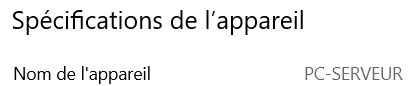

Attribution d'une IP statique :

Dans un premier temps nous allons lancer dans un cmd la commande

```cmd
ipconfig/all
```

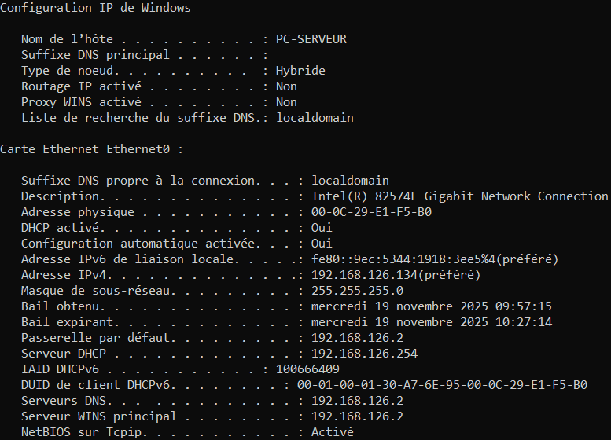

Nous pouvons voir que notre adresse IP actuelle est : 192.168.126.134

Notre masque de sous-réseau est 255.255.255.0

Notre adresse de passerelle par défaut est 192.168.126.2

Notre serveur DHCP est 192.168.126.254

Maintenant que nous avons nos informations nous pouvons les rentrer
manuellement dans nos paramètres réseaux :

Nous allons cliquer sur notre icône de réseau :

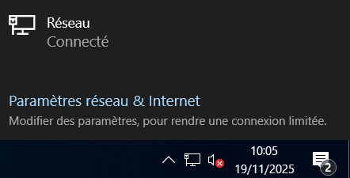

Puis dans Paramètres réseau & Internet

Ensuite Modifier les options d'adaptateur :

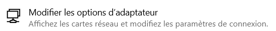

Ensuite clic droit sur notre réseau Ethernet puis Propriétés

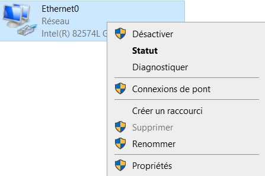

Puis nous allons nous rendre dans les propriétés du protocole IPV4 :

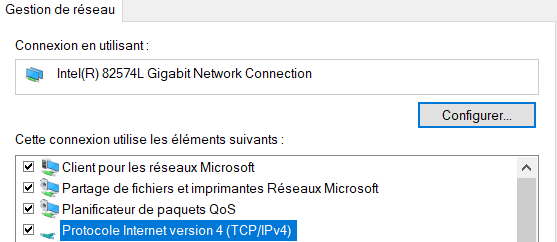

On ajoute notre configuration réseau puis une coche la case valider les
paramètres en quittant bien sûr :

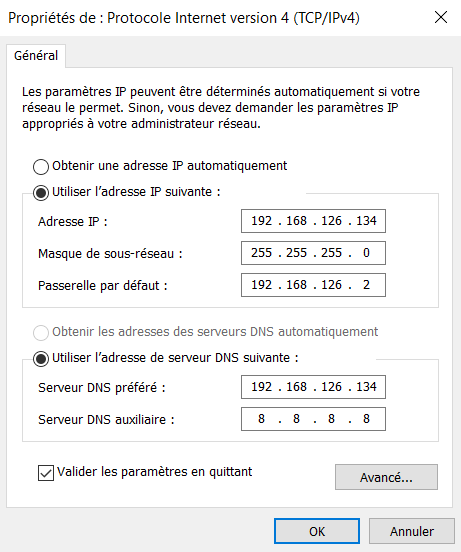
Notre configuration réseau a bien été pris en compte :

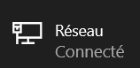

Avant d'installer notre Active Directory, il ne nous reste plus qu'à
créer une snapshot de notre configuration actuelle :

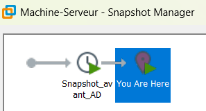

La snapshot avant AD a bien été mis en place on peut passer à la suite

## 2. Installation et configuration d'AD DS

Après avoir installé AD DS, nous pouvons voir qu'il est bien dispo dans
notre gestionnaire de serveur :

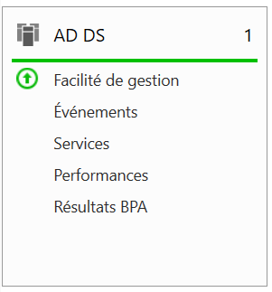

Nous devons désormais le configurer :

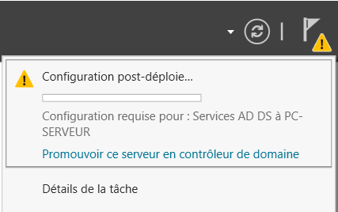

Nous allons ajouter la nouvelle forêt lab.local :

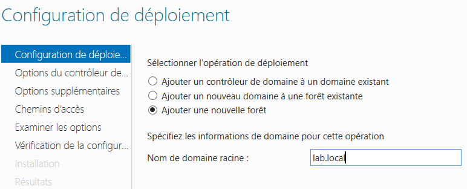

On laisse les options comme telle et on définit un mot de passe pour la
restauration des services d'annuaire (DSRM)

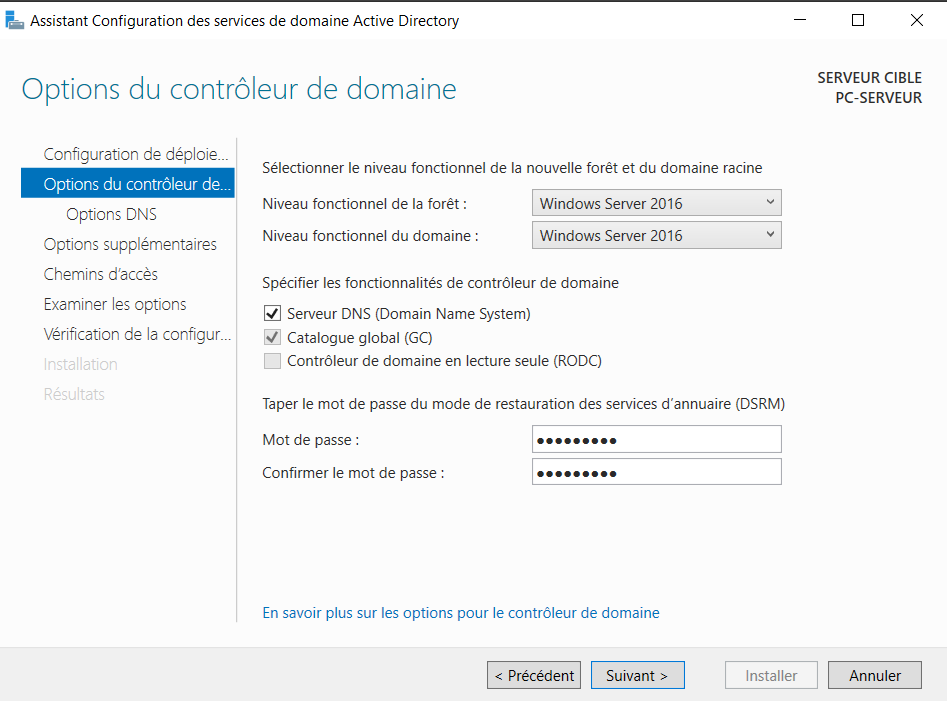

On ajoute un nom de domaine Netbios :

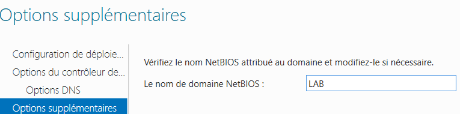

Malheureusement lorsqu'on essaye de passer à l'installation nous avons
une erreur critique car notre Administrateur n'a pas de mot de passe
définit ce qui est une violation des règles de sécurité sur notre
Serveur

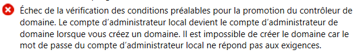

Nous allons donc le modifier via PowerShell en admin :

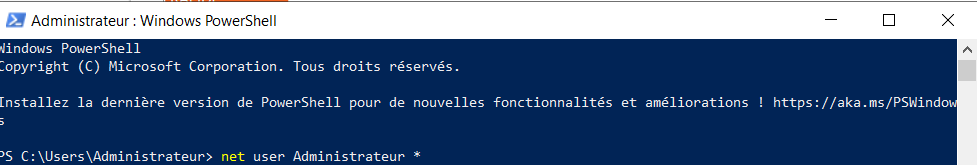

Le mot de passe de notre utilisateur Admin a donc été modifié :

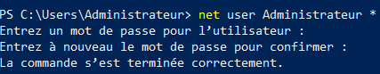

Après ajout d'un mot de passe à notre Administrateur nous n'avons plus
d'erreurs critiques et nous pouvons donc procéder à l'installation de
notre nouvelle configuration :

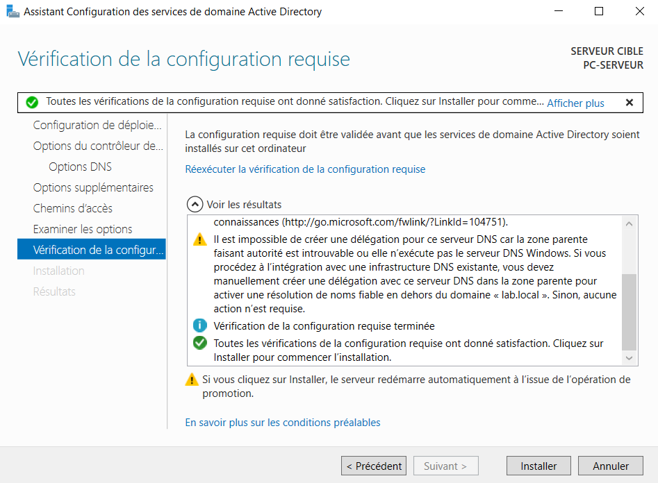

Une fois l'installation complété notre serveur redémarre :

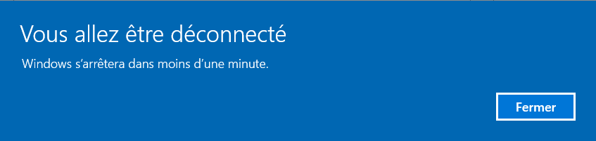

Au prochain login on est bien sur le domaine :

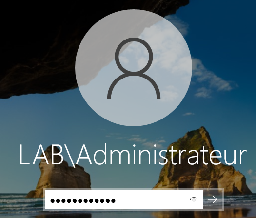

Il ne nous reste plus qu'à nous connecter avec nos identifiants

Pour donner suite à l'ajout de notre machine dans le domaine notre
configuration réseau à changer mais ce n'est pas grave nous allons juste
ajouter le dns auxiliaire 8.8.8.8 qui redirige vers internet pour avoir
de la connexion internet :

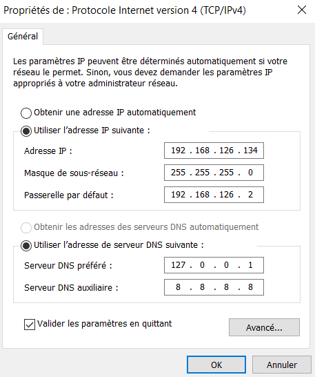

Ce qui intéressant de noter c'est qu'il n'est pas nécessaire de remettre
notre adresse IP à la place du serveur DNS préféré, 127.0.0.1 fait déjà
référence à l'adresse IP de notre machine locale, il va toujours
s'interroger en premier

Avant :


Après :


Notre connexion internet est bien revenu

Avant d'ajouter des utilisateurs nous allons faire un test DNS pour être
sûr que le DNS et l'AD sont bien fonctionnel

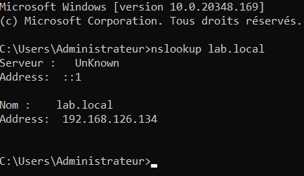

On obtient bien notre nom de domaine ainsi que notre adresse IP

Nous allons désormais créer une OU et y rajouter des utilisateurs via
powershell en admin

## 3. Création des Unités d'Organisation et Comptes

Nous allons créer les Unités d'Organisation (OU) nécessaires ainsi que les comptes utilisateurs initiaux via PowerShell en tant qu'administrateur :

```powershell
# 1. Création des Unités d'Organisation (OU)
New-ADOrganizationalUnit -Name "Students" -Path "DC=lab,DC=local"
New-ADOrganizationalUnit -Name "Servers" -Path "DC=lab,DC=local"

# 2. Création des comptes utilisateurs standards
New-ADUser -Name "Alice Student" -SamAccountName "alice" -AccountPassword (ConvertTo-SecureString "P@ssw0rd123!" -AsPlainText -Force) -Enabled $true -Path "OU=Students,DC=lab,DC=local"
New-ADUser -Name "Bob Student" -SamAccountName "bob" -AccountPassword (ConvertTo-SecureString "P@ssw0rd123!" -AsPlainText -Force) -Enabled $true -Path "OU=Students,DC=lab,DC=local"

# 3. Création du compte administratif pédagogique
New-ADUser -Name "LabAdmin" -SamAccountName "labadmin" -AccountPassword (ConvertTo-SecureString "AdminP@ss!" -AsPlainText -Force) -Enabled $true -Path "OU=Students,DC=lab,DC=local"
```

## 4. Ajout de la machine cliente dans le domaine

Tout d'abord nous allons modifier la configuration réseau de notre
machine cliente :

Via la commande ipconfig voici les paramètres que nous pouvons trouver :

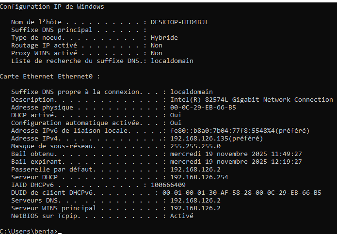

L'adresse IP est 192.168.126.35

Le masque de sous-réseau est 255.255.255.0

L'adresse de passerelle est 192.168.126.2

On va donc mettre cette configuration sur la machine cliente :

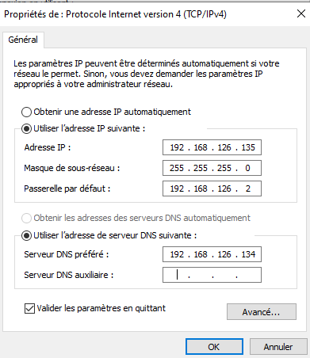

Nous allons également indiquer l'adresse IP de notre serveur en tant que
DNS

Même après le changement d'internet notre machine est toujours connectée
au réseau, notre configuration est donc correcte :


On peut également faire un test de connectivité avant le déploiement :

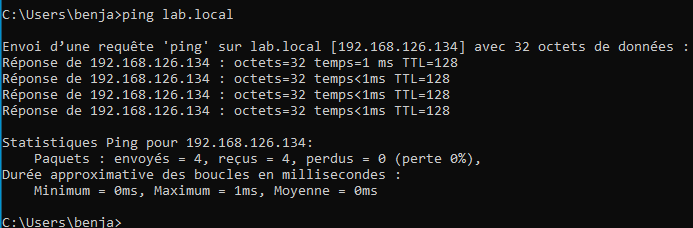

Notre domaine est bien accessible, on peut passer au déploiement

Pour faire en sorte que le PC rejoigne le domaine nous allons aller dans
les paramètres Windows -> à propos de -> Renommer ce PC (avancé)

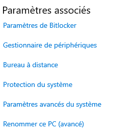

Puis dans la fenêtre qui s'ouvre nous allons nous rendre dans modifier :

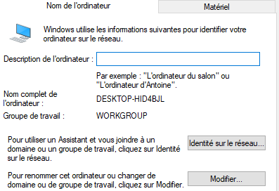

On va rentrer le nom de notre domaine pour pouvoir le rejoindre :

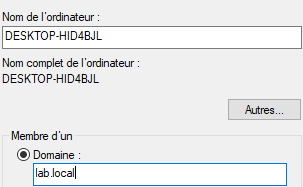

On va nous demander de rentrer le compte d'un compte autorisé à se
connecter sur le domaine nous allons indiquer le compte admin de notre
machine serveur :

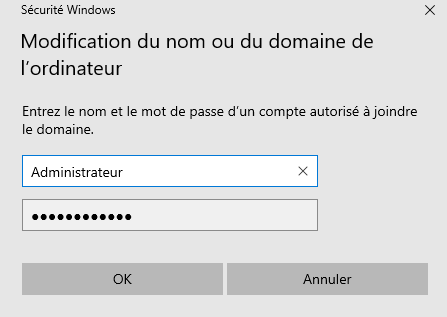

Nous sommes désormais bien connectées sur le domaine :

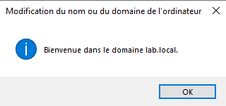

Pour tester le bon fonctionnement de notre domaine nous allons nous
déconnecter pour pouvoir se connecter avec un compte utilisateur

Nous allons désormais tenter de nous connecter avec le compte Alice :

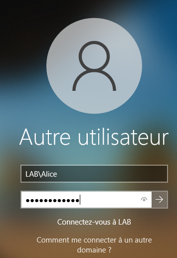

La commande whoami nous montre qu'on est bien connectée en tant
qu'Alice :

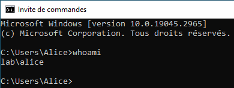

```powershell
Gpresult /r 
```

permet de montrer la stratégie de groupe actuellement appliquer :

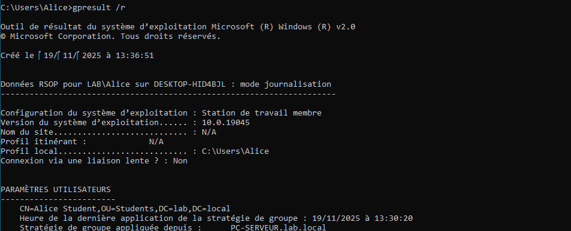

## 5. Déploiement des Politiques de Sécurité (GPO & Hardening)

Pour modifier ceci ont doit aller dans notre gestionnaire de serveur ->
outils -> Gestion des stratégies de groupe

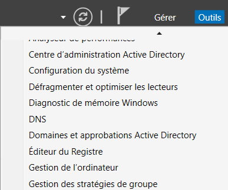

On déroule jusqu'à trouver notre domaine :

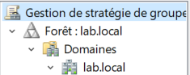

Clic droit sur default domain policy puis modifier :

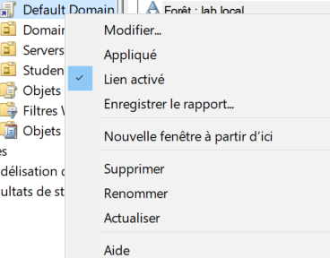

Ensuite dans la fenêtre qui va s'ouvrir on fait défiler jusqu'à
Stratégies de mots de passe :

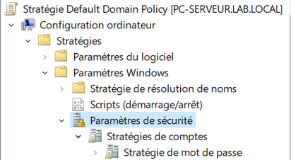

On va modifier nos règles en termes de sécurité de cette manière :

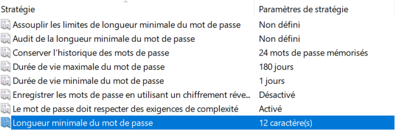

Nous allons désormais appliquer une stratégie concernant le verrouillage
de compte :

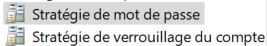

On modifie les paramètres de cette manière :

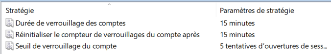

### 5.1 GPO d'Audit Avancé

Pour faire ceci on va faire un clic droit sur notre nom de domaine puis
on va cliquer sur "Créer un objet GPO dans ce domaine, et le lier ici :

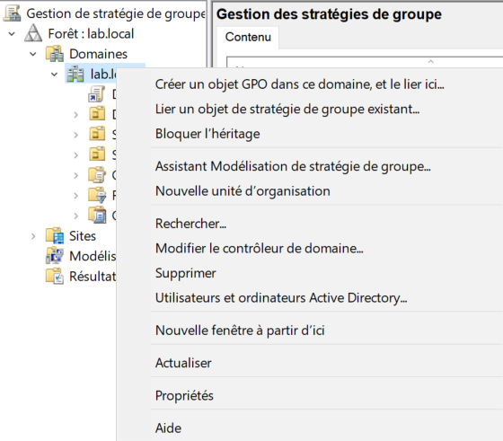

On va nommer notre GPO de cette manière :

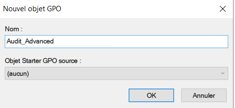

Nous allons ensuite faire un clic droit sur cette gpo puis modifier :

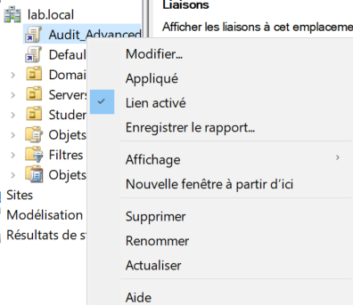

On déroule jusqu'à trouver stratégie d'audit :

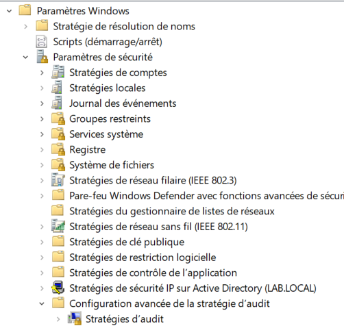

Dans ouvrir/fermer la sessions nous allons mettre en place les
paramètres suivants :
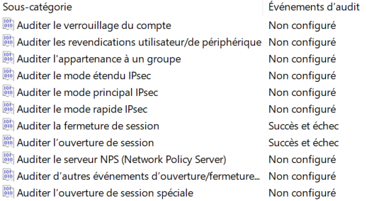

Dans connexion de compte on met en place le paramètre suivant :

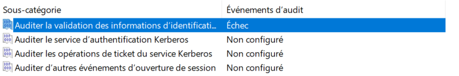


Dans accès DS on met en place les paramètres suivants :

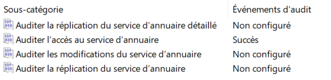

Nous allons désormais forcer la mise en place de nos politiques de
sécurité :

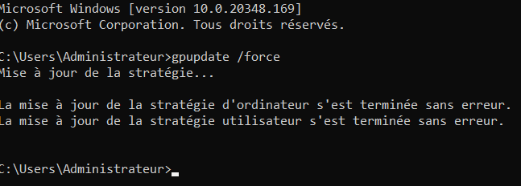
Voilà notre stratégie de domaine à bien été modifié

### 5.2 GPO Firewall

Après avoir créé notre GPO firewall nous allons la lier à l'OU students
:


En plus de notre domaine, notre nouvelle GPO est bien liée à l'OU
students :


On déroule jusqu'à trouver pare-feu Windows Defender avec fonctions
avancées de sécurité :


On va cliquer sur propriété du pare-feu Windows Defender :


Nous allons modifier les paramètres du pare-feu de cette manière :


Nous allons ensuite modifier les paramètres des règles du trafic entrant
:


Nous allons créer une nouvelle règle :


Nous allons sélectionner Port :


On applique la règle suivante :


On autorise la connexion :


Ainsi notre règle de trafic entrant est bien mise en place :


### 5.3 Configuration d'AppLocker

On créer une nouvelle GPO


On déroule jusqu'à trouver applocker :


On clique droit dessus puis propriétés :


On ajoute cette règle dans les propriétés :


Nous allons ensuite dans règles de l'exécutable :


Puis créer des règles par défaut :


Nos règles sont bien ajoutées :


On applique notre nouvelle stratégie :


Les objets de stratégie de groupe sont bien présents :


On utilise bien Kerberos au lieu de NTLM :


La politique en termes de mot de passe est bien mise en place :


## 6. Tests, Audits et Remédiations

### 6.1. Validation des politiques de base (Mots de passe & AppLocker)

#### Modification du mot de passe d'Alice

Ici on va tenter de modifer le mot de passe d'alice pour quelquechose de
beaucoup plus faible :


On obtient une erreur car ce nouveau MDP ne respecte pas les règles mise
en place en termes de mots de passe.

#### Vérification du fonctionnement AppLocker

Pour vérifier son bon fonctionnement nous allons ouvrir un programme,
n'importe

Ici j'ai ouvert la calculatrice :


Je vais ensuite démarrer l'observateurs d'événements

Nous allons nous rendre dans journaux des applications et des services
-> Microsoft puis Windows


Dans toutes les applis et services disponibles nous allons chercher le
AppLocker :


Puis dans EXE et DLL on trouve bien la trace que notre calculatrice est
allumée et que AppLocker là vu ce qui prouve qu'il analyse en permanence


#### Test Verrouillage de comptes

Après avoir tenté de se connecter au compte Alice avec un mauvais mot de
passe on obtient le message suivant :


#### Mise en place de nouveaux comptes

Création des comptes d'administration et de service via PowerShell :

```powershell
# 1. Création du compte de service de sauvegarde
New-ADUser -Name "ServiceBackup" -SamAccountName "svc_backup" -AccountPassword (ConvertTo-SecureString "P@ssw0rd123!" -AsPlainText -Force) -Enabled $true -Path "OU=Students,DC=lab,DC=local"

# 2. Création du compte d'audit sécurité
New-ADUser -Name "AuditSec" -SamAccountName "auditsec" -AccountPassword (ConvertTo-SecureString "P@ssw0rd123!" -AsPlainText -Force) -Enabled $true -Path "OU=Students,DC=lab,DC=local"

# 3. Création du compte technicien administrateur
New-ADUser -Name "TechAdmin" -SamAccountName "techadmin" -AccountPassword (ConvertTo-SecureString "P@ssw0rd123!" -AsPlainText -Force) -Enabled $true -Path "OU=Students,DC=lab,DC=local"

# 4. Ajout initial de TechAdmin au groupe Admins du domaine (Faille à remédier)
Add-ADGroupMember -Identity "Admins du domaine" -Members "techadmin"
```

### 6.2. Phase 1 : Observation, Cartographie et Sécurisation des Identités

#### Étape 1 : Lister les privilèges et appliquer le moindre privilège

Lorsqu'on se rend dans l'outils "Utilisateurs et ordinateurs Active
Directory" -> Users -> Admins du domaine nous pouvons voir les
utilisateurs qui appartiennent à ce groupe :


Évidemment, TechAdmin ne devraient absolument pas être dans ce groupe :


C'est une violation complète du principe du moindre privilège. Un
technicien support à besoin de droits pour réinitialiser des mots de
passe ou joindre des PC au domaine, mais pas de contrôler les
contrôleurs de domaine. Si ce compte est compromis, l'attaquant devient
maître de tout le réseau instantanément

Remédiation de la faille de sécurité :

Dans un premier temps nous allons supprimer l'utilisateur du Groupe
Admins du domaine :


A ce stade, le compte TechAdmin est redevenu un utilisateur lambda, il
ne peut plus rien casser mais il ne peut plus travailler non plus, nous
devons donc lui mettre des droits appropriés à ses tâches

Pour faire ceci on va ajouter une nouvelle délégation de contrôle sur
l'unité d'organisation Students :


Bien sûr on sélectionne le compte TechAdmin comme nouvelle délégation de
contrôle :


Une fois qu'on clique sur OK on va obtenir confirmation que
l'utilisateur a bien été ajouté en tant que contrôleur de cette OU :


Pour finir on va lui donner deux droits fondamentaux pour réaliser ses
tâches :

- Le droit de « Réinitialiser les mots de passe utilisateur et forcer le
  changement de mot de passe à la prochaine ouverture de session

- Le droit de « Créer, supprimer et gérer des comptes utilisateurs »


Vérification : Désormais nous allons nous connecter en tant que
TechAdmin puis essayer si les changements ont été bien pris en compte

Dans un premier temps en testant une manipulation autorisée, si on peut
modifier le mot de passe d'un students

Puis en essayant une manipulation de non autorisé en essayant de
modifier le mdp de l'administrateur

Si on essaye de modifier le mot de passe d'une simple utilisatrice, la
manipulation est bien réussie :


En revanche si on essaye de modifier le mot de passe d'un admin ce dont
nous n'avons pas le droit alors l'accès sera refusé :


Voilà la faille de sécurité est ainsi bien patchée

#### Étape 2 : Analyser et restreindre les ACLs réseau

Nous créons un nouveau dossier appeller Data_Sensible sur notre disque C
sur le serveur :


On peut observer que le groupe Users est présent par défaut avec des
droits de Lecture/Exécution :


C'est une faille de sécurité, ça serait innaceptable par exemple dans le
cas de données sensibles, les simples utilisateurs ne doivent pas
accéder à tout

Le groupe Users contient tout le monde dans le domaine (y compris Alice,
Bob et d'autres). Par défaut Windows permet la lecture à tous. Pour des
données confidentielles, il faut désactiver l'héritage des droits et
supprimer le groupe Users pour ne laisser que les groupes RH spécifiques
et Admins

Remédiation de la faille :


Après nous être rendu dans les propriétés du dossier Data_Sensible puis
être aller dans l'onglet Sécurité et avoir cliquez sur le bouton Avancé

Nous allons désactiver l'héritage et cliquer sur l'option « Convertir
les autorisations héritées en autorisations explicites sur cet objet »
Cela va permettre de garder les droits actuels pour les trier ensuite,
plutôt que de tout vider d'un coup

Nous allons ensuite supprimer toutes les autorisations du Groupe
Utilisateurs sur ce fichier :


Ainsi le groupe Utilisateurs n'est plus présent dans la liste des
groupes qui ont des permissions sur ce fichier :


Test :

Sur notre Machine cliente nous allons essayer d'accéder aux partages de
fichiers avec un compte Utilisateurs, avec notre nouvelle configuration
ça ne doit pas être possible


Nous ne pouvons pas accéder aux partage réseau, c'est normal nous
n'appartenons pas un groupe assez haut dans la hiérarchie

La faille a donc été patchée

#### Étape 3 : Vérification des droits locaux

Ici on va utiliser la commande whoami /groups sur la machine cliente en
étant connecté en tant qu'Alice, normalement nous ne devrions voir que
les groupes en rapport avec son niveau de hiérarchie :


Effectivement, notre configuration est bonne Alice ne voit que les
groupes en rapport avec son niveau dans la hiérarchie

Heureusement d'ailleurs car si Alice était admin locale, un virus
exécuté par Alice pourrait s'installer profondément dans le système,
désactiver l'antivirus ou voler les mdp d'autres utilisateurs (comme
celui d'un admin qui viendrait dépanner son PC)

### 6.3. Phase 2 : Authentification et Sécurisation Avancée


#### Étape 1 : Audit Kerberos vs NTLM
Dans un premier temps nous allons nous connecter aux serveurs de fichier
via le nom de domaine :


Si ensuite on exécute la commande 

```cmd
klist 
```

via le cmd on peut voir qu'un ticket à bien été demandé auprès de Kerberos, sûrement un ticket TGS puisque c'est une demande à un SPN :


Si on exécute la même commande via l'adresse IP du serveur nous n'allons
pas obtenir de nouvelle demande à Kerberos :


Voici ce qu'on peut en déduire : L'accès par IP ne génère pas de ticket
Kerberos

Pourquoi ? Kerberos a besoin d'un SPN (Service Principal Name) basé sur
un nom (DNS). Quand on tape une IP, Windows ne peut pas faire confiance
à l'identité du serveur via Kerberos, il bascule donc sur NTLM
(authentification plus ancienne et moins sécurisée, basée sur hash des
mots de passe)

Le risque est que NTLM est beaucoup plus vulnérable que Kerberos car il
utilise les hash des mots de passe comme preuve d'identité

#### Étape 2 : Analyse et migration des comptes de service (gMSA)

Ici nous avons un compte de service qui est rattaché à l'AD :


Nous pouvons voir que la case : "Le mot de passe n'expire jamais" est
coché

Est-ce que c'est un risque ? Ça peut effectivement poser problèmes

Si le mot de passe expire : Le service de Backup plantera le jour où le
mot de passe change, car le logiciel de backup ne se mettre pas à jour
tout seul -> risque de disponibilité

Si le mot de passe n'expire jamais : Si un pirate vole ce mdp
aujourd'hui, il pourra l'utiliser dans 3 ans -> Risque de
confidentialité

Le mieux aujourd'hui est de mettre en place de gMSA (Group Managed
Service Accounts) Ce sont des comptes spéciaux gérés par l'AD qui
changent leur mdp tout seuls (des mots de passes de 120 caractères) sans
faire planter les services.

**Remédiation de la faille :**

Pour remplacer le compte `svc_backup` (dont le mot de passe n'expire jamais), nous déployons un compte gMSA avec rotation automatique des secrets :

```powershell
# 1. Création de la clé racine KDS (requise pour Active Directory)
Add-KdsRootKey -EffectiveImmediately

# 2. Création du compte gMSA et autorisation de la machine serveur à l'utiliser
New-ADServiceAccount -Name "gmsa_backup" -DNSHostName "gmsa_backup.lab.local" -PrincipalsAllowedToRetrieveManagedPassword "PC-SERVEUR$"

# 3. Installation et validation du compte sur le serveur local
Install-ADServiceAccount -Identity "gmsa_backup"
Test-ADServiceAccount -Identity "gmsa_backup"
```

Parfait notre compte gMSA a bien été mis en place

#### Étape 3 : Application d'une politique de mot de passe granulaire (PSO)

Actuellement nous avons une politique de mot de passe qui demande 12
caractères minimal :


Mais aujourd'hui l'ANSSI recommande une approche basée sur l'entropie :

Pour un mdp classique (Mous, Chiffres, Lettres) : 12 caractères est le
minimum vital aujourd'hui pour un utilisateur standard

Pour un compte admin (comme Administrateur), 12 caractères est
insuffisant. L'ANSSI recommande 15 caractères minimum ou l'utilisation
de l'authentification multifacteur (MFA)

Remédiation de la faille :

Pour régler cette faille de sécurité nous allons créer une PSO (Password
Settings Object)

Nous allons dans un premier temps nous rendre dans le « Centre
D'administration Active Directory » :


Nous allons défiler de lab (local) -> System -> Password Settings
Container :


Dans tâches nous allons cliquer sur Nouveau puis Paramètres de mot de
passe :


Nous allons appliquer la PSO suivante :


On lui attribue une priorité de 10 pour avoir de la marge (plus le
chiffre est petit et plus la PSO sera prioritaire)

On impose une longueur minimale de mot de passe de 15 caractères

On coche bien sûr la case qui demande que le mot de passe doive
respecter des exigences de complexité

On peut laisser les autres paramètres par défaut

Nous devons ensuite se rendre dans l'onglet « S'applique directement à »
et on va sélectionner notre groupe Admins du domaine :


Il ne nous reste plus qu'à valider notre PSO

Le test :

Pour faire ceci on va tenter de modifier le mot de passe de l'admin mais
seulement avec 14 caractères, si notre PSO a bien été appliqué
normalement on devrait obtenir une erreur qui indique que le mot de
passe ne respecte pas la complexité :


Comme attendu on obtient bien une erreur

En revanche si on essaye la même manipulation avec 15 caractères on ne
devrait pas avoir d'erreur :


Comme attendu la commande s'exécute sans problème

Notre PSO est bien réalisé, la faille a bien été patché

## 7. Bilan & Synthèse Sécurité

| Axe de Sécurité | Faille / Constat Initial | Solution & Remédiation Appliquée |
| :--- | :--- | :--- |
| **Gestion des Identités** | `TechAdmin` membre des *Admins du domaine* | Retrait du groupe + Délégation de contrôle limitée sur l'OU `Students` |
| **Sécurité des Données** | Groupe `Users` en accès complet sur `Data_Sensible` | Désactivation de l'héritage + Suppression des accès du groupe `Users` |
| **Comptes de Service** | `svc_backup` avec mot de passe statique non expirant | Migration vers un **gMSA** (`gmsa_backup`) avec clé racine KDS |
| **Politique Mots de Passe** | Longueur unique de 12 caractères pour tous | Application d'une **PSO** imposant 15 caractères minimum aux administrateurs |
